# Arquitectura

## Flujo de datos

El proyecto integra **3 fuentes independientes** en un único esquema estrella conformado
(un 4to sub-portal, Banca Pública de Superbancos, se suma a CAPCOL ampliando su cobertura
de `tipo_entidad` sin ser una fuente nueva en sí — ver más abajo; una 5ta fuente real, SEPS,
**implementada y cargada 2021-2025 el 2026-09-30**, ver bloque SEPS abajo y
`docs/fuentes_datos.md` sección 4.0).
Cada fuente tiene su propio extractor/parser, pero todas convergen en la misma capa
`marts.*` — la identidad de banco y los catálogos de producto/plazo son compartidos
(resueltos en Python antes de `staging.*`, ver sección "Catálogos conformados" abajo).

**Banca Pública** (`capcol-instituciones-publicas/`, investigado y diseñado 2026-09-01):
mismo plugin/formato/grano que `capcol-bancos` — no es un sub-flujo nuevo en el diagrama de
abajo, es CAPCOL cargando `tipo_entidad='BANCO PUBLICO'` además de `'BANCO PRIVADO'` en las
mismas `raw.cartera`/`raw.depositos`/`staging.cartera`/`staging.depositos`/
`fact_saldo_cartera`/`fact_saldo_depositos`. Cero migraciones de esquema necesarias (el
`CHECK` de `dim_banco.tipo_entidad` y la 7ma fila `INVERSIÓN PÚBLICA` de
`dim_segmento_credito` ya lo soportaban). Detalle completo, identidad, y qué falta
(extractor/parser/`_REFRESH_MARTS_SQL`, carril de `data-engineer`) en
`docs/fuentes_datos.md` sección 1.1.

**SEPS** (cooperativas S1-S3 + mutualistas, `uv run benchmark-bancos seps`): descarga
directa (`src/benchmark_bancos/extract/download_seps.py`, sin Playwright) de 3 ZIP por año, parseados por
`src/benchmark_bancos/transform/parse_seps.py`. **No agrega tablas**: captaciones entra a
`staging.depositos` → `fact_saldo_depositos`, colocaciones (que son saldos) a
`staging.cartera` → `fact_saldo_cartera`, y los estados financieros a
`staging.boletin_balance/pyg` → `fact_balance`/`fact_pyg`. La identidad es el RUC del
archivo, con la misma llave `BCE_<ruc>` que BCE ya había auto-registrado. Solo hubo tres
migraciones: `sql/29` (tipo `ENTIDAD DE SEGUNDO PISO`), `sql/30` (categoría
`DEPÓSITOS A LA VISTA`) y `sql/31` (`provincia` en la llave natural de staging, porque hay
cantones homónimos que la SEPS sí reporta en el mismo mes).

```
CAPCOL (cartera/depósitos)          BCE tsp/tsa (tasas semanales)      TasasHistorico.htm       Boletín (BALANCE/PYG)
Playwright, plugin OneDrive         descarga directa (urllib)          descarga directa          Playwright, plugin OneDrive
scrape_superbancos.py               download_bce.py                    download_tasas_           scrape_boletin.py
        │                                   │                          historicas.py                     │
        ▼                                   ▼                                │                           ▼
data/raw/{anio}/*.zip           data/raw/bce/ts{p,a}_*.zip          data/raw/bce/historico/*.htm   data/raw/{anio}/boletin/*.zip
        │  parse_cartera.py/                │  parse_bce_tasas.py           │  parse_tasas_             │  parse_boletin.py
        │  parse_depositos.py               │                               │  historicas.py            │
        ▼                                   ▼                               ▼                           ▼
raw.cartera / raw.depositos      raw.bce_tasas_pasivas/activas    raw.tasas_referenciales    raw.boletin_balance/pyg
        │  upsert por llave natural (ON CONFLICT DO UPDATE ... WHERE row_hash IS DISTINCT — ver "Carga incremental")
        ▼
staging.*   (tipado, banco_codigo/categoria/segmento ya resueltos, columnas fecha_carga/fecha_actualizacion/row_hash)
        │  refresh_marts() (SQL puro, INSERT...SELECT...ON CONFLICT, idempotente)
        ▼
marts.dim_* / marts.fact_*   (esquema estrella conformado — 10 dimensiones + 10 tablas de hechos)
        │
        ▼
Power BI (.pbip, Import desde Postgres)
```

## Modelo de datos (esquema estrella)

10 dimensiones y 10 tablas de hechos en `marts.*`, resultado final del flujo anterior.
`dim_fecha`/`dim_banco` son compartidas por casi todas las fuentes; `dim_canton`,
`dim_provincia`, `dim_segmento_credito`, `dim_subsegmento_credito`, `dim_segmento_entidad`,
`dim_categoria_deposito`, `dim_plazo` y `dim_cuenta_contable` son compartidas solo por las
fuentes que las necesitan (ver "Catálogos conformados" abajo). `dim_provincia` y
`dim_segmento_entidad` (2026-07-25) son outriggers de `dim_canton`/`dim_banco`
respectivamente. **`dim_canton` es FK directa tanto de CAPCOL (`fact_saldo_cartera`/
`fact_saldo_depositos`) como de BCE tsp/tsa (`fact_captaciones_depositos`/
`fact_colocaciones_cartera`, 2026-09-01, `sql/28_bce_canton_grain.sql`)** — antes BCE
solo llegaba a `dim_provincia` (grano provincia, sin cantón); provincia/región de BCE se
alcanzan hoy por el mismo snowflake que ya usaba CAPCOL (`canton_id → dim_provincia`), sin
una segunda convención de geografía en el esquema. Detalle de cada columna en
`docs/data_dictionary.md`.

```mermaid
erDiagram
    dim_fecha {
        int fecha_id PK
        date fecha
        int anio
        int mes
        int trimestre
        int anio_mes
    }
    dim_banco {
        int banco_id PK
        string banco_codigo
        string banco
        string tipo_entidad
        string ruc
        int segmento_entidad_id FK
        string estado_validacion
    }
    dim_provincia {
        int provincia_id PK
        string provincia
        string region
    }
    dim_canton {
        int canton_id PK
        string canton
        int provincia_id FK
        string estado_validacion
    }
    dim_segmento_entidad {
        int segmento_entidad_id PK
        string tipo_segmento
    }
    dim_segmento_credito {
        int segmento_id PK
        string segmento
    }
    dim_subsegmento_credito {
        int subsegmento_id PK
        string subsegmento
        int segmento_id FK
    }
    dim_categoria_deposito {
        int categoria_deposito_id PK
        string categoria
    }
    dim_plazo {
        int plazo_id PK
        int dias_desde
        int dias_hasta
        string plazo_codigo
        string estado_validacion
    }
    dim_cuenta_contable {
        int cuenta_id PK
        string reporte
        string codigo
        string cuenta
        int nivel
        string codigo_padre
        string seccion
        string grupo_met
        string estado_validacion
    }

    fact_saldo_cartera {
        int fecha_id FK
        int banco_id FK
        int canton_id FK
        int segmento_id FK
        numeric saldo_por_vencer
        numeric saldo_no_devenga_intereses
        numeric saldo_vencida
        numeric saldo_total
    }
    fact_saldo_depositos {
        int fecha_id FK
        int banco_id FK
        int canton_id FK
        int categoria_deposito_id FK
        int plazo_id FK
        numeric saldo
        bigint numero_cuentas
        bigint numero_clientes
    }
    fact_captaciones_depositos {
        int fecha_id FK
        int banco_id FK
        int categoria_deposito_id FK
        int plazo_id FK
        int canton_id FK
        int segmento_entidad_id FK
        numeric monto_total
        numeric tasa_pasiva_efectiva
    }
    fact_colocaciones_cartera {
        int fecha_id FK
        int banco_id FK
        int subsegmento_id FK
        int plazo_id FK
        int canton_id FK
        int segmento_entidad_id FK
        numeric monto_total
        numeric tasa_activa_efectiva
    }
    fact_tasas_referenciales_cartera {
        int fecha_id FK
        int subsegmento_id FK
        numeric tasa_activa_maxima
        numeric tasa_activa_referencial
    }
    fact_tasas_referenciales_depositos_instrumento {
        int fecha_id FK
        int categoria_deposito_id FK
        numeric tasa_pasiva_promedio
    }
    fact_tasas_referenciales_depositos_plazo {
        int fecha_id FK
        int plazo_id FK
        numeric tasa_pasiva_referencial
    }
    fact_tasas_referenciales_sistema {
        int fecha_id PK
        numeric tasa_pasiva_referencial_sistema
        numeric tasa_activa_referencial_sistema
    }
    fact_balance {
        int fecha_id FK
        int banco_id FK
        int cuenta_id FK
        numeric saldo_usd
    }
    fact_pyg {
        int fecha_id FK
        int banco_id FK
        int cuenta_id FK
        numeric valor_usd
    }

    dim_fecha ||--o{ fact_saldo_cartera : fecha_id
    dim_fecha ||--o{ fact_saldo_depositos : fecha_id
    dim_fecha ||--o{ fact_captaciones_depositos : fecha_id
    dim_fecha ||--o{ fact_colocaciones_cartera : fecha_id
    dim_fecha ||--o{ fact_tasas_referenciales_cartera : fecha_id
    dim_fecha ||--o{ fact_tasas_referenciales_depositos_instrumento : fecha_id
    dim_fecha ||--o{ fact_tasas_referenciales_depositos_plazo : fecha_id
    dim_fecha ||--o| fact_tasas_referenciales_sistema : fecha_id
    dim_fecha ||--o{ fact_balance : fecha_id
    dim_fecha ||--o{ fact_pyg : fecha_id

    dim_banco ||--o{ fact_saldo_cartera : banco_id
    dim_banco ||--o{ fact_saldo_depositos : banco_id
    dim_banco ||--o{ fact_captaciones_depositos : banco_id
    dim_banco ||--o{ fact_colocaciones_cartera : banco_id
    dim_banco ||--o{ fact_balance : banco_id
    dim_banco ||--o{ fact_pyg : banco_id
    dim_segmento_entidad ||--o{ dim_banco : segmento_entidad_id
    dim_segmento_entidad ||--o{ fact_captaciones_depositos : segmento_entidad_id
    dim_segmento_entidad ||--o{ fact_colocaciones_cartera : segmento_entidad_id

    dim_provincia ||--o{ dim_canton : provincia_id

    dim_canton ||--o{ fact_saldo_cartera : canton_id
    dim_canton ||--o{ fact_saldo_depositos : canton_id
    dim_canton ||--o{ fact_captaciones_depositos : canton_id
    dim_canton ||--o{ fact_colocaciones_cartera : canton_id

    dim_segmento_credito ||--o{ fact_saldo_cartera : segmento_id
    dim_segmento_credito ||--o{ dim_subsegmento_credito : segmento_id
    dim_subsegmento_credito ||--o{ fact_colocaciones_cartera : subsegmento_id
    dim_subsegmento_credito ||--o{ fact_tasas_referenciales_cartera : subsegmento_id

    dim_categoria_deposito ||--o{ fact_saldo_depositos : categoria_deposito_id
    dim_categoria_deposito ||--o{ fact_captaciones_depositos : categoria_deposito_id
    dim_categoria_deposito ||--o{ fact_tasas_referenciales_depositos_instrumento : categoria_deposito_id

    dim_plazo ||--o{ fact_saldo_depositos : plazo_id
    dim_plazo ||--o{ fact_captaciones_depositos : plazo_id
    dim_plazo ||--o{ fact_colocaciones_cartera : plazo_id
    dim_plazo ||--o{ fact_tasas_referenciales_depositos_plazo : plazo_id

    dim_cuenta_contable ||--o{ fact_balance : cuenta_id
    dim_cuenta_contable ||--o{ fact_pyg : cuenta_id
```



Nombres renombrados 2026-07-19 a un glosario de negocio consistente: **cartera** = negocio
de crédito (siempre), **depositos** = negocio de captación (siempre); **saldo_** = medida
de balance (CAPCOL); **colocaciones_**/**captaciones_** = tasa efectiva + monto por banco
(BCE semanal); **tasas_referenciales_** = techo/referencial a nivel sistema (BCE mensual).
Nombres anteriores: `fact_cartera`→`fact_saldo_cartera`, `fact_depositos`→`fact_saldo_depositos`,
`fact_tasas_activas`→`fact_colocaciones_cartera`, `fact_tasas_pasivas`→`fact_captaciones_depositos`,
`fact_tasas_referenciales_credito`→`fact_tasas_referenciales_cartera`,
`fact_tasas_pasivas_instrumento`→`fact_tasas_referenciales_depositos_instrumento`,
`fact_tasas_pasivas_plazo`→`fact_tasas_referenciales_depositos_plazo`. De paso se
eliminaron 3 columnas nunca pobladas (`saldo_x_tasa`, `tasa_ponderada` en ambas tablas de
saldo; `morosidad` en `fact_saldo_cartera`) — la tasa real ya vive en
`fact_colocaciones_cartera`/`fact_captaciones_depositos`. Ver `sql/15_rename_fact_tables.sql`.

**Segmentación de crédito: 2 dimensiones normativas, no una** (2026-07-19,
`sql/16_dim_segmento_normativo.sql`): `dim_segmento_credito` (7 valores, nivel grueso:
PRODUCTIVO/CONSUMO/EDUCATIVO/INMOBILIARIO/VIVIENDA DE INTERÉS PÚBLICO/MICROCRÉDITO/
INVERSIÓN PÚBLICA) y `dim_subsegmento_credito` (26 valores, nivel fino tal como lo
reporta BCE) están unidas por FK propia — antes eran una sola tabla con el rollup a
CAPCOL como columna `TEXT` nullable (`tipo_credito_capcol`), sin garantía de que
coincidiera con el `tipo_credito` (también texto libre) de `fact_cartera`. CAPCOL nunca
trae el sub-segmento fino, así que `fact_saldo_cartera.segmento_id` referencia el nivel
grueso directo; BCE sí reporta al nivel fino, así que `fact_colocaciones_cartera`/
`fact_tasas_referenciales_cartera` referencian `dim_subsegmento_credito` vía
`subsegmento_id`. `estado_cartera` en `fact_saldo_cartera` sigue como dimensión
degenerada (columna directa, solo 3 valores fijos, no una jerarquía real). `plazo_id` en
`fact_saldo_depositos` es nullable (`NULL` salvo `categoria_deposito = 'DEPÓSITOS A PLAZO'`)
y las 4 tablas de `tasas_referenciales_*` son a nivel sistema (sin `dim_banco`, ver
`docs/data_dictionary.md`).

Este diagrama es la vista **estructural** del modelo (qué se relaciona con qué). No
sustituye la definición de negocio de cada campo (`docs/data_dictionary.md`), la
procedencia campo a campo (`docs/linaje_datos.md`) ni el marco de responsable/
clasificación/calidad (`docs/gobernanza_datos.md`) — las 4 piezas juntas son la
gobernanza de datos completa del proyecto, ver `docs/gobernanza_datos.md` para cómo
encajan entre sí.

## Catálogos conformados (identidad compartida entre fuentes)

La identidad de banco (`banco_codigo`) y los catálogos de segmento de crédito/categoría de
depósito/plazo se resuelven **en Python, en la capa `transform`, antes de que el dato
llegue a `staging.*`** — no como tabla de alias en el esquema estrella:

- `src/benchmark_bancos/transform/banco_matching.py`: `resolver_banco_codigo(nombre, fuente)`. Reglas
  determinísticas (tildes, mayúsculas, prefijos `BP `/`BANCO`, sufijos legales) resuelven
  variaciones triviales; lo que la regla no cubre (nombre legal completo de BCE vs. código
  corto de CAPCOL/Boletín, o los 2 renames reales de CAPCOL) se resuelve contra
  `src/benchmark_bancos/seeds/banco_crosswalk.csv`, sembrado a mano y versionado en git. Un nombre no
  resuelto **falla fuerte** (`BancoNoResueltoError`) — nunca se autogenera un banco nuevo
  silenciosamente. **2026-09-01** (Banca Pública, `capcol-instituciones-publicas/`, ver
  `docs/fuentes_datos.md` sección 1.1): primer uso del crosswalk donde `banco_codigo` no
  apunta a un código curado de `src/benchmark_bancos/seeds/banco_maestro.csv` sino a un `BCE_<ruc>` que
  `resolver_entidad_bce()` ya auto-registró en `marts.dim_banco` — deliberado, para que
  los 3 bancos públicos que reporta este sub-portal (`BANECUADOR B. P.`, `BANCO DE
  DESARROLLO DEL ECUADOR B.P.`, `CORPORACION FINANCIERA NACIONAL B.P.`) resuelvan a la
  MISMA fila de `dim_banco` que ya generó BCE en vez de crear una identidad paralela. Esto
  introduce una dependencia de orden de carga que no existía antes para CAPCOL/Boletín
  (que siempre resolvían por identidad 100% curada, independiente de si BCE había corrido):
  el `INNER JOIN` de `fact_saldo_cartera`/`fact_saldo_depositos` en `refresh_marts()`
  descarta en silencio una fila cuyo `banco_codigo` todavía no exista en `marts.dim_banco`
  — ver el detalle completo del riesgo y la mitigación recomendada en
  `docs/mantenimiento_catalogos.md` sección 1 y `docs/fuentes_datos.md` sección 1.1.
- `src/benchmark_bancos/transform/categoria_deposito_matching.py` y `bce_plazo_matching.py`: mismo patrón
  para separar categoría/plazo (CAPCOL mezclaba ambos conceptos en `tipo_deposito`) y para
  resolver los buckets de plazo con prefijo ordinal de BCE (`a. MENOS DE 30 DIAS`, etc.).
- `dim_subsegmento_credito` (26 valores, universo completo de BCE) y `dim_categoria_deposito`
  (12 valores) **no se filtran por tipo de entidad**. Desde 2026-07-19 esto ya no es solo
  el catálogo: `fact_captaciones_depositos`/`fact_colocaciones_cartera` (BCE tsp/tsa) tampoco filtran —
  cargan el sistema financiero completo (442 bancos en `dim_banco`: 33 privados curados +
  409 entidades auto-registradas por RUC, ver `docs/gobernanza_datos.md`). Corrige una
  versión anterior que sí filtraba a bancos privados **antes de llegar a `raw.*`**,
  perdiendo el resto del sistema para siempre.
- `dim_plazo` es un catálogo abierto por rango numérico de días, auto-descubierto por cada
  fuente (`INSERT ... ON CONFLICT DO NOTHING`) — **no se fuerza una equivalencia entre
  convenciones distintas** (ej. CAPCOL "DE MÁS DE 361 DÍAS" y BCE tsp "MAS DE 360 DIAS"
  quedan como filas distintas, cada una con el límite real de su fuente). Validación de 2
  niveles en Python antes de `staging` (`bce_plazo_matching.py`/`categoria_deposito_matching.py`/
  `parse_tasas_historicas.py`): shape regex inválido o rango inválido (`dias_desde > dias_hasta`)
  sigue siendo fallo duro (`PlazoNoResueltoError`); shape+rango válidos pero fuera del
  universo curado (`PLAZOS_*_VALIDOS`) ya no lanza — se auto-ingresa con
  `estado_validacion='AUTO_INGRESADO'` (2026-08-30, `sql/27_dim_plazo_estado_validacion.sql`,
  ver `docs/data_dictionary.md` para el detalle completo y por qué solo `dim_plazo` de los
  5 catálogos "cerrados" recibe este tratamiento).
- `dim_canton` (BCE tsp/tsa, 2026-09-01, `sql/28_bce_canton_grain.sql`) recibe el mismo
  mecanismo two-tier que `dim_plazo` pero por una razón distinta: no es una de las 5
  enumeraciones cerradas por definición normativa/regulatoria de arriba, es un catálogo
  geográfico real y finito (INEC) — un cantón nuevo en el dato es autoexplicativo una vez
  que la provincia ya es conocida, igual que un rango de días nuevo lo es para `dim_plazo`.
  `src/benchmark_bancos/transform/canton_matching.py::resolver_canton_bce(canton, provincia)` resuelve
  SIEMPRE por el par completo (nunca cantón solo — existen cantones reales homónimos en 2
  provincias por reclasificación administrativa histórica, ej. `LA CONCORDIA`,
  `SANTO DOMINGO`): provincia no resoluble → `CantonNoResueltoError`, fail-fast; par
  cantón+provincia fuera del universo sembrado (`src/benchmark_bancos/seeds/canton_provincia.csv`, 228
  pares) → no lanza, se auto-ingresa `AUTO_INGRESADO`.

## Carga incremental (CDC) — no full refresh

Tres niveles, de grueso a fino (rediseñado 2026-10-05, `sql/33`/`sql/34`):

1. **Archivo**: `meta.source_files` registra cada archivo cargado con su sha256. Un
   archivo con el mismo hash no se vuelve a parsear (`is_source_loaded()`).
2. **Fila de staging/marts (CDC por columnas)**: `staging.*` y los `fact_*`/`dim_banco`
   tienen `fecha_carga` (se pone una vez) y `fecha_actualizacion` (solo se mueve si el
   dato realmente cambió). El upsert compara directamente las columnas mutables:

   ```sql
   INSERT INTO staging.tabla (...) SELECT ... FROM _tmp_tabla   -- COPY a tabla temporal
   ON CONFLICT (llave_natural)
   DO UPDATE SET col = EXCLUDED.col, fecha_actualizacion = now()
   WHERE (staging.tabla.a, staging.tabla.b) IS DISTINCT FROM (EXCLUDED.a, EXCLUDED.b);
   ```

   Hasta `sql/34` existía una columna `row_hash` (`GENERATED ... md5(...)`) por tabla y el
   guard comparaba hashes. Se eliminó: era el md5 de 1 a 6 columnas de la propia fila, la
   comparación directa de esas mismas columnas es equivalente (también para NULL) y el
   hash ocupaba ~1,3 GB. Las columnas comparadas son exactamente las que cubría cada md5
   (`CDC_COLUMNS` en `load_postgres.py` y los guards de `_REFRESH_MARTS_SQL`). Verificado:
   tras el cambio, un refresh completo deja todas las tablas de `marts` idénticas
   (huella de contenido por tabla).
3. **Refresh de marts incremental**: `refresh_marts()` ya no relee staging completo.
   Lee la marca de agua de `meta.refresh_watermark` y recalcula solo el alcance
   `(fecha, banco_codigo)` de las filas de staging con `fecha_actualizacion` posterior
   (índice en cada `staging.*.fecha_actualizacion`). Se recalcula el entity-mes completo
   porque `fact_saldo_cartera` agrega 3 filas de staging (los estados de morosidad) en
   una. El SQL es el mismo que el del refresh completo: el modo incremental solo cambia
   `staging.X` por una tabla temporal `src_X` con ese alcance. Medido en la base viva:
   un refresh sin cambios pasó de **196 s a 0,03 s**. Sin marca (base nueva) o con
   `benchmark-bancos refresh --full` se hace el recorrido completo (~3 min). Supone un
   solo escritor a la vez; ver el docstring de `refresh_marts()`.

Correr el pipeline dos veces seguidas sin datos nuevos no genera ningún `UPDATE` real.

**Sin capa `raw` en la base (2026-10-05, `sql/33`)**: hasta entonces cada fila parseada
se guardaba además como JSONB en `raw.*` (12 GB, 55% de la base). Ningún proceso la leía,
y no era el dato original: era la fila ya agregada/pivotada que también llega a staging.
La fuente de verdad son los archivos en `data/raw/**` más su hash en
`meta.source_files`. Reprocesar desde esos archivos reconstruye staging y marts.

**Excepción deliberada**: `marts.dim_cuenta_contable`, `staging.banco_maestro` y
`marts.dim_plazo` NO tienen `fecha_carga`/`fecha_actualizacion`/`row_hash` — no son
hechos con carga incremental por `row_hash`, son catálogos que se resiembran/enriquecen
(`dim_cuenta_contable`/`banco_maestro`, `ON CONFLICT DO UPDATE` sin guard de CDC porque
no hay noción de "cambió de verdad" que proteger: `upsert_dim_cuenta_contable()` solo
mejora `grupo_met` cuando antes era NULL, `load_banco_maestro_seed()`/
`upsert_banco_maestro_ruc()` reafirman valores curados/RUC en cada corrida sin costo) o
se auto-descubren de forma puramente aditiva (`dim_plazo`, `ON CONFLICT DO NOTHING`, sin
`UPDATE` en absoluto — una fila que ya existe nunca se toca, así que no hay nada que un
`row_hash` necesite proteger). `estado_validacion` (2026-08-30, `sql/25`/`sql/26`/`sql/27`)
se agregó a las 3 tablas sin necesitar extender un `row_hash` que nunca existió ahí.

**¿Por qué no Data Vault?** Data Vault (Hub/Link/Satellite) resuelve integrar muchas
fuentes de alta velocidad de cambio con auditoría regulatoria estricta, normalmente como
capa de integración *debajo* de un modelo Kimball. Con 3 fuentes y cadencia
mensual/semanal, sería sobre-ingeniería. Los archivos fuente conservados en disco más su
`source_hash` en `meta.source_files` ya dan la parte valiosa de esa filosofía (nunca se
pierde el dato original) sin el formalismo completo de Hub/Link/Satellite.

### Bug real encontrado y corregido: NULL en `UNIQUE`/`ON CONFLICT`

SQL trata `NULL <> NULL` **incluso bajo una restricción `UNIQUE`**, así que
`UNIQUE (a, b)` con `b` nullable no detecta conflicto entre dos filas `(1, NULL)` — cada
corrida de `refresh_marts()` insertaba una fila "nueva" para el bucket de plazo sin límite
superior (`dias_hasta IS NULL`), duplicando `dim_plazo` y produciendo fan-out en el JOIN
de `fact_depositos` (hoy `fact_saldo_depositos`, ver renombrado 2026-07-19 arriba). Fix (ver `sql/10_fix_null_unique_constraints.sql`): reemplazar el
`UNIQUE` plano por un índice único sobre `COALESCE(col, sentinela)`, y apuntar
`ON CONFLICT` a esa misma expresión — verificado que `ON CONFLICT (a, COALESCE(b, -1))`
sí detecta el conflicto. Este mismo patrón se aplicó preventivamente a toda columna
nullable dentro de una llave natural nueva (`plazo_id`, `provincia`, `dias_hasta`).

## Por qué Playwright y no requests/httpx

El listado de archivos por año en `capcol-bancos` no es HTML estático: se renderiza con
un plugin WordPress ("Share-one-Drive") que trae los archivos desde una carpeta de
OneDrive/SharePoint vía llamadas AJAX a `admin-ajax.php`. Además, el plugin **persiste
la última carpeta vista** entre navegaciones (recargar la página con `page.goto()` no
resetea al listado raíz de años, hay que usar el breadcrumb "Inicio" — ver
`_reset_to_root()` en el scraper). Sin un navegador real esto no es scrapeable de forma
simple.

## Estructura real de los archivos fuente (verificado, no solo la ficha metodológica)

- **Cartera**: un ZIP por segmento de crédito y año (`Cartera de Consumo DICIEMBRE
  2024.zip`, etc.), cada uno con una hoja `BASE ...` en formato ancho (una columna por
  estado de cartera). El archivo de "Vivienda" es la excepción: trae **dos** hojas BASE
  (inmobiliario y vivienda de interés público son tipo_credito distintos aunque
  compartan archivo). `tipo_credito` se deriva del **nombre de la hoja**, no del nombre
  del archivo, precisamente por este caso.
- **Depósitos**: un solo ZIP por año con todos los tipos de depósito en una hoja `BASE
  ...`, con una columna `TIPO DE DEPOSITO` ya granular (incluye buckets de plazo por
  rango de días, más fino que la ficha metodológica de 2017).
- **Ambos reportes traen el detalle a nivel de cuenta contable/oficina**: múltiples filas
  pueden compartir la llave (fecha, banco, cantón, tipo_credito/tipo_deposito) y deben
  **sumarse**, no sobrescribirse. Se detectó con datos reales (no era evidente en la
  documentación) y se corrigió agregando en el parser antes de cargar a staging.
- **Nombres de carpeta cambiaron en 2024**: `COLOCACIONES`/`CAPTACIONES` (2021-2023) →
  `CARTERA`/`DEPOSITOS` (2024-2025). El layout de columnas internas es idéntico entre
  ambos periodos — el "cambio de esquema" es solo de nomenclatura de carpeta/archivo,
  no de estructura de datos.
- **No hay tasa de interés en ninguno de los dos reportes.** Se confirmó contra la ficha
  metodológica y contra archivos reales descargados. Decisión (con el usuario): dejar
  `tasa_ponderada`/`saldo_x_tasa` como columnas nullable en `marts.fact_*`, sin poblar en
  v1. Para incorporarlas habría que sumar el reporte separado de tasas de interés
  activas/pasivas de Superbancos como una nueva fuente.

## Evaluación de escalabilidad

- **Volumen no es el riesgo**: ~123k filas en `fact_saldo_cartera` (2026-07-25: pivotado
  a columnas por estado, antes ~370k — ver `sql/21_fact_saldo_cartera_pivot.sql`), ~251k
  en `fact_saldo_depositos` (CAPCOL, 2021-01 a 2026-06); **`fact_captaciones_depositos`/
  `fact_colocaciones_cartera` a grano cantón desde 2026-09-01** (`sql/28_bce_canton_grain.sql`
  cambió el grano de provincia a cantón, `data-engineer` reprocesó el histórico completo el
  mismo día — ver `docs/data_dictionary.md` y `docs/gobernanza_datos.md`): **3.077.474 /
  7.756.581 filas**, 0 con `canton_id` NULL en ninguna (antes ~1.96M/~4.87M a grano
  provincia — el aumento real, ~1.57x, quedó en línea con el ~1.6x estimado sobre
  combinaciones distintas de jun-2026: 26.998 a grano cantón vs. 16.393 a grano provincia)
  (BCE semanal, histórico completo 2008-2026, sistema financiero completo — no solo bancos
  privados, ver `docs/gobernanza_datos.md`); ~2.18M en `fact_balance` y ~192k en `fact_pyg`
  (Boletín, 2021-2026). `raw.bce_tasas_pasivas`/`activas` son más grandes todavía (~3.08M y ~7.76M
  filas respectivamente — grano cantón, sin agregar; los nombres `raw.*` no cambiaron,
  solo los de `marts.*`). El BCE
  semanal es el volumen dominante con margen — se cargó vía `COPY` (no `executemany`) por
  esa razón, ~10-100x más rápido a este volumen. Postgres lo maneja sin particionar ni
  tuning especial; `refresh_marts()` completo sobre todo el dataset acumulado toma
  ~5-6 minutos (subió desde ~1-2 min al dejar de filtrar BCE a solo bancos privados).
- **El riesgo real es el *schema drift* de la fuente**: ya se observó un cambio de
  nomenclatura de carpetas/archivos en 2024. Mitigación: `raw.*` preserva el archivo tal
  cual (JSONB) para poder reprocesar sin volver a descargar si un parser cambia; la
  detección de `tipo_credito` por nombre de hoja (no de archivo) y de `tipo_deposito` por
  columna (no por archivo) hace el parser más robusto a estos cambios superficiales.
- **El riesgo de extracción es el acoplamiento al plugin del sitio** (selectores CSS,
  comportamiento de navegación). Aislado en `src/benchmark_bancos/extract/scrape_superbancos.py`; si el
  sitio cambia, solo ese módulo necesita ajustarse — transform/load no se ven afectados
  porque trabajan desde `data/raw/` ya descargado.
- **Idempotencia end-to-end**: `raw.source_files` evita reprocesar un archivo sin
  cambios (por hash); `staging.*` y `marts.*` usan `ON CONFLICT DO UPDATE` sobre la
  llave natural, así que correr el pipeline de nuevo (o solo para un año) siempre
  converge al mismo resultado.
- **Para portafolio/distribución**: `docker-compose.yml` deja Postgres + esquema listos
  con un solo comando, sin depender de la instalación local del autor.
- Pandas es suficiente a esta escala; Airflow/Spark serían sobre-ingeniería para una
  fuente que publica mensualmente. Si el proyecto creciera a más reportes (morosidad,
  liquidez) o más países, el patrón raw→staging→marts ya soporta agregarlos sin
  rediseño: un parser + un mapping nuevo por reporte.

## Portabilidad de motor — inventario de construcciones específicas de Postgres

Este proyecto usa Postgres, no un motor genérico "SQL estándar" — varias piezas del
diseño se apoyan en features propias de Postgres. Inventario real (grep contra
`sql/*.sql` y `src/benchmark_bancos/load/load_postgres.py`, no de memoria) de qué se usa, dónde, y su
equivalente concreto si algún día hubiera que portar a SQL Server o a un lakehouse
(Databricks/Delta, con nota de Snowflake donde aplica):

**1. Columnas calculadas `GENERATED ALWAYS AS (...) STORED`** (`row_hash` en casi todas
las tablas de `staging`/`marts`, `saldo_total` en `fact_saldo_cartera`)
- Dónde: `row_hash` aparece en `sql/05_dim_banco_rework.sql:32,39`,
  `sql/07_dim_banco_dim_fecha_rebuild.sql:31`, `sql/09_fact_cartera_depositos_rework.sql:27,43`,
  `sql/11_schema_bce.sql:54,80,103,126`, `sql/12_schema_tasas_historicas.sql:49,63,75,85,100`,
  `sql/13_schema_boletin.sql:58,74,88,100`, `sql/15_rename_fact_tables.sql:37`,
  `sql/16_dim_segmento_normativo.sql:131`, `sql/17_dim_banco_ruc_sin_tamano.sql:21`,
  `sql/19_dim_segmento_entidad.sql:32,41,53,63,77`, `sql/21_fact_saldo_cartera_pivot.sql:26`,
  `sql/26_dim_banco_estado_validacion.sql:46` (2026-08-30, extiende el `row_hash` de
  `marts.dim_banco` para cubrir `estado_validacion` — `marts.dim_cuenta_contable` gana
  `estado_validacion` en `sql/25` pero esa tabla nunca tuvo `row_hash`/CDC propio, ver
  `docs/data_dictionary.md`) (30 ocurrencias en total). `saldo_total` en
  `sql/21_fact_saldo_cartera_pivot.sql:22-23`.
- **Nota de mantenimiento real** (bug encontrado y corregido 2026-08-30, ver
  `docs/gobernanza_datos.md`): el `UPDATE` SCD1 de `marts.dim_banco.segmento_entidad_id`
  en `src/benchmark_bancos/load/load_postgres.py` (bloque `dim_banco.segmento_entidad_id: conveniencia...`)
  no puede usar `EXCLUDED` (no es un `INSERT ... ON CONFLICT`), así que **recalcula a
  mano** la misma expresión del `row_hash` `GENERATED` en su cláusula `WHERE`. Esa
  fórmula duplicada quedó desincronizada una vez ya (se agregó `estado_validacion` al
  `GENERATED` sin actualizar el recálculo manual) y rompió el no-op de CDC en silencio
  hasta que se verificó explícitamente — cualquier migración futura que extienda este
  `row_hash` debe tocar las 2 ubicaciones en el mismo cambio.
- **SQL Server**: `columna AS (expresión) PERSISTED` — mismo concepto (columna calculada
  materializada, indexable), pero `MD5()` no existe nativo: se reemplaza por
  `CONVERT(VARCHAR(32), HASHBYTES('MD5', ...), 2)` (`HASHBYTES` devuelve `VARBINARY`).
- **Databricks/Delta**: Delta Lake soporta `GENERATED ALWAYS AS (expr)` en `CREATE TABLE`
  desde Delta Lake 1.2+, sintaxis casi idéntica — aunque en la práctica de Databricks se
  usa sobre todo para derivar columnas de partición, no hashes de fila completos.
  **Snowflake** no tiene columnas `STORED`: sus columnas `AS (expr)` son virtuales (se
  recalculan en cada lectura, no se persisten ni indexan), así que el patrón de acá se
  movería a un `MERGE` que calcule el hash explícitamente al escribir, o a una vista.
- *Por qué Postgres acá*: una sola fuente de verdad para "¿cambió esta fila?" — ni el ETL
  ni una migración futura pueden desincronizar el hash del contenido real (ver
  `sql/21_fact_saldo_cartera_pivot.sql` líneas 8-11 y la sección "Carga incremental" arriba).

**2. Patrón de upsert `ON CONFLICT (...) DO UPDATE ... WHERE row_hash IS DISTINCT FROM EXCLUDED.row_hash`**
- Dónde: vive en Python, no en `sql/*.sql` (la identidad se resuelve antes de `staging`,
  principio de diseño #2) — `src/benchmark_bancos/load/load_postgres.py` líneas 140-144
  (`staging.cartera`), 167-176 (`staging.depositos`), 244-246 (`_upsert_bce_via_temp`,
  genérico para las 4 tablas BCE), 297-299 (`tasas_referenciales`), 364-366 (Boletín
  balance/PyG), 428-430 (`marts.dim_banco`), 497-502/522-527/549-556/578-585 (los 4
  `fact_*` de CAPCOL/BCE), 618-666 (4 `fact_tasas_referenciales_*`), 681-696
  (`fact_balance`/`fact_pyg`) — 17 usos del patrón en total.
- **SQL Server**: no existe `ON CONFLICT`; el equivalente es
  `MERGE INTO destino USING origen ON (llave) WHEN MATCHED AND destino.row_hash <> origen.row_hash THEN UPDATE SET ... WHEN NOT MATCHED THEN INSERT (...) VALUES (...);`
  — mismo resultado lógico, con la salvedad de que `MERGE` en SQL Server tiene bugs de
  concurrencia documentados por Microsoft bajo aislamiento alto (no recomendado sin
  locking explícito en cargas concurrentes).
- **Databricks/Delta**: `MERGE INTO destino USING origen ON llave WHEN MATCHED AND destino.row_hash <> origen.row_hash THEN UPDATE SET * WHEN NOT MATCHED THEN INSERT *`
  — sintaxis `MERGE` nativa de Delta Lake, casi calcada. **Snowflake** usa el mismo
  `MERGE INTO` con idéntica semántica de `WHEN MATCHED`/`WHEN NOT MATCHED`.
- *Por qué Postgres acá*: el guard "solo actualizar si cambió de verdad" vive en el SQL,
  no como lógica adicional en el ETL — correr el pipeline de nuevo (o solo para un año)
  converge sin generar `UPDATE`s espurios (ver "Carga incremental (CDC)" arriba).

**3. `JSONB` en `raw.*` (+ índice GIN)**
- Dónde: `sql/01_schema_raw.sql` líneas 20 y 32 (`data JSONB NOT NULL` en
  `raw.cartera`/`raw.depositos`), líneas 45-46 (`CREATE INDEX ... USING GIN (data)`).
- **SQL Server**: columna `NVARCHAR(MAX)` con el JSON como texto + `JSON_VALUE`/
  `JSON_QUERY`/`OPENJSON` para leerlo; sin índice nativo sobre el documento completo —
  se indexarían columnas calculadas persistidas que extraen claves puntuales, no el
  equivalente de un GIN sobre todo el JSON (SQL Server 2025/Fabric anuncian un tipo
  `JSON` binario nativo más cercano a JSONB, pero no es la versión objetivo de este
  proyecto).
- **Databricks/Delta**: sin tipo JSON binario tradicional — se guarda como `STRING` y se
  parsea con `from_json`/`get_json_object`, o (en runtimes recientes) tipo `VARIANT`
  semi-estructurado con poda a nivel de archivo (data skipping/Z-order) en vez de un
  índice GIN. **Snowflake** sí tiene un tipo `VARIANT` nativo maduro con clustering
  automático — el más parecido a JSONB de los tres motores comparados.
- *Por qué Postgres acá*: el layout de columnas de la fuente (Superbancos) cambió entre
  años (renombre colocaciones/captaciones → cartera/depositos en 2024, ver
  `sql/01_schema_raw.sql` líneas 5-7) — JSONB deja `raw.*` inmune a ese drift sin perder
  filas ni romper la carga, y el GIN permite consultar el JSON crudo sin re-parsear si
  un parser necesita reprocesarse.

**4. Carga masiva vía `COPY ... FROM STDIN`**
- Dónde: `src/benchmark_bancos/load/load_postgres.py`, función `_copy_rows()` líneas 183-192 (usa
  `cur.copy(copy_sql)` de psycopg3), invocada en líneas 208 (`COPY raw.{table} (...)
  FROM STDIN`), 231 (`COPY _tmp_{table} (...) FROM STDIN`), 346 y 357. El patrón "COPY a
  tabla temporal + `INSERT ... ON CONFLICT`" (líneas 217-226:
  `CREATE TEMP TABLE _tmp_{table} (LIKE staging.{table} INCLUDING DEFAULTS) ON COMMIT DROP`)
  existe, según el comentario de la línea 219, porque "COPY no soporta ON CONFLICT
  directamente" — no se puede hacer COPY directo a `staging.*`.
- **SQL Server**: `BULK INSERT`/`OPENROWSET(BULK...)` desde un archivo en disco/blob, o
  la API `SqlBulkCopy` desde el cliente — no hay equivalente de "COPY desde STDIN" en una
  sesión interactiva; normalmente se usa la utilidad `bcp` por línea de comandos o
  `SqlBulkCopy` desde Python/.NET. El truco de "bulk load a una tabla de staging +
  `MERGE`" de acá es exactamente el patrón recomendado en SQL Server también.
- **Databricks/Delta**: `COPY INTO tabla FROM 'ruta_en_object_storage'` — comando nativo
  de Delta Lake pensado para este caso de uso exacto (carga masiva idempotente por
  archivo, con seguimiento de qué archivos ya se cargaron — conceptualmente equivalente
  a `raw.source_files` acá). **Snowflake** tiene el mismo comando,
  `COPY INTO <tabla> FROM @stage`.
- *Por qué Postgres acá*: ~10-100x más rápido que `executemany` a los volúmenes de BCE
  semanal (comentario `src/benchmark_bancos/load/load_postgres.py` líneas 184-185: "cientos de miles de
  filas por archivo, todo el histórico semanal 2008-2026 en un solo CSV").

**5. Esquemas `raw` / `staging` / `marts` dentro de una sola base**
- Dónde: `CREATE SCHEMA IF NOT EXISTS raw AUTHORIZATION bp_etl` (`sql/01_schema_raw.sql:9`),
  `staging` (`sql/02_schema_staging.sql:5`), `marts` (`sql/03_schema_marts.sql:4`).
- **SQL Server**: mapea 1:1 — `CREATE SCHEMA raw/staging/marts AUTHORIZATION ...` dentro
  de la misma base, mismo mecanismo de namespacing y permisos por esquema.
- **Databricks/Delta (Unity Catalog)**: mapea directo al patrón *medallion* estándar de
  Databricks — típicamente `bronze`/`silver`/`gold` en vez de `raw`/`staging`/`marts`
  (mismo rol exacto: bronze = crudo tal cual, silver = tipado/limpio, gold = agregado
  para consumo), como 3 esquemas dentro de un catálogo de Unity Catalog (namespace de 3
  niveles `catalogo.esquema.tabla`) o como 3 catálogos separados si se quiere aislamiento
  más fuerte entre capas. **Snowflake** usa esquemas dentro de una base igual que
  Postgres/SQL Server — portable sin cambio de concepto.
- *Por qué Postgres acá*: separación física de capas dentro de la misma base, sin la
  sobrecarga operativa de 3 bases/clusters distintos — suficiente al volumen actual (ver
  "Evaluación de escalabilidad" arriba).

**6. (bonus) Cláusula de agregación `FILTER (WHERE ...)`**
- Dónde: `sql/21_fact_saldo_cartera_pivot.sql:35-37` (3 usos, pivote de
  `estado_cartera`) y `sql/18_glosario_cuentas_views.sql` (4 usos).
- **SQL Server** y **Snowflake**: ninguno de los dos soporta `FILTER` — se reescribe como
  `SUM(CASE WHEN condición THEN columna ELSE 0 END)`.
- **Databricks/Delta (Spark SQL)**: sí soporta `FILTER (WHERE ...)` desde Spark 3.x,
  sintaxis idéntica a Postgres.
- *Por qué Postgres acá*: más legible que el `CASE WHEN` equivalente para expresar "una
  columna de medida por cada valor mutuamente excluyente de una ex-dimensión degenerada"
  (ver comentario inicial de `sql/21_fact_saldo_cartera_pivot.sql`).

## Power BI: cómo se construyó y qué quedó armado

El `.pbip` (`powerbi/benchmark-cartera-depositos.*`) se escribió a mano en TMDL/PBIR (no
se generó desde Power BI Desktop, porque no hay forma de automatizar el diseño visual
desde este entorno). Para reducir el riesgo de un archivo corrupto, el modelo semántico y
el reporte se validaron estructuralmente contra los **JSON Schema oficiales de Microsoft**
(`report.schema.json`, `page.schema.json`, `pagesMetadata.schema.json`,
`visualContainer.schema.json`) antes de darlos por terminados, y cada `Entity`/`Property`
referenciado en un visual se verificó contra las medidas/columnas reales del TMDL. Esto no
sustituye abrirlo en Power BI Desktop, pero elimina la clase de error más común (URLs de
`$schema` desactualizadas, campos requeridos faltantes, nombres de medida mal escritos).

- **Modelo semántico completo**: 8 tablas conectadas a Postgres (`marts.*`, incluye
  `dim_provincia` desde 2026-07-25), relaciones fact→dim, 17 medidas DAX (saldo, saldo
  "último mes", morosidad, market share, HHI, variación m/m y a/a, ratio cartera/depósitos).
- **5 páginas de reporte con visuales reales** (no solo el lienzo vacío):
  - **Overview y KPIs**: 4 tarjetas (`Saldo Cartera (Ultimo Mes)`, `Saldo Depositos
    (Ultimo Mes)`, `Morosidad % (Ultimo Mes)`, `HHI Cartera (Ultimo Mes)`) + línea de
    tendencia mensual `Saldo Cartera`/`Saldo Depositos` (todo el rango cargado en
    `marts.dim_fecha`, 2021-01 a 2026-06 a la fecha).
  - **Benchmark por Banco**: dos barras horizontales (cartera y depósitos del último mes
    por `dim_banco[banco]`).
  - **Análisis Geográfico**: dos barras horizontales por `dim_provincia[provincia]`
    (2026-07-25: antes `dim_canton[provincia]`, columna movida a `dim_provincia` al
    normalizar — ver "Normalización de provincia" en `docs/gobernanza_datos.md`).
  - **Tendencias y Estacionalidad**: línea de `Saldo Cartera` por mes, una serie por año
    (`dim_fecha[anio]` como leyenda) para ver estacionalidad.
  - **Correlación Cartera vs Depósitos**: tabla por banco con saldo de cartera, saldo de
    depósitos y `Ratio Cartera / Depositos`.
  - Las medidas `*(Ultimo Mes)` filtran internamente a `MAX(dim_fecha[fecha])` para que
    las tarjetas y barras muestren la foto del mes más reciente, no la suma de los 60
    meses cargados (que no tendría sentido como cifra "actual").

**Al abrir el `.pbip` por primera vez**: Power BI pedirá credenciales de Postgres
(usuario `bp_etl`, la contraseña que configuraste en `sql/00_roles_db.sql`) y el modo de
autenticación de privacidad de datos. También recomendable: click derecho en
`dim_fecha` → "Marcar como tabla de fechas" (necesario para que `Variacion Cartera
MoM`/`YoY` con `DATEADD` funcionen correctamente).

**Qué queda para terminar tú en Desktop** (diseño, no estructura): colores, formato de
tarjetas, un mapa real en la página geográfica (se usó barras por ser más simple de
generar por JSON sin errores; un mapa/treemap es una mejora fácil de aplicar en Desktop),
slicers de fecha/banco, y cualquier ajuste de layout — todo esto es iteración visual que
es más confiable hacer en el diseñador de Desktop que a mano en JSON.

**Herramienta usada para validar/construir los visuales**: se clonó y consultó (no se
instaló como skill de Claude) el repo público
[lukasreese/powerbi-claude-skills](https://github.com/lukasreese/powerbi-claude-skills),
que trae copias locales de los JSON Schema de Microsoft para PBIR y templates de
visuales ya probados. Confirma que **no existe forma de controlar Power BI Desktop en
vivo** (ni esa herramienta ni ninguna otra conocida lo hace) — el método siempre es
escribir los archivos `.pbip`/PBIR y abrirlos después en Desktop.
