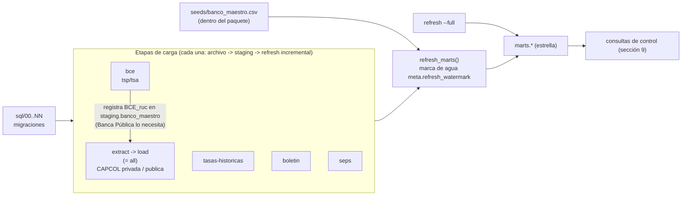

# Despliegue y orquestación — runbook

Cómo levantar **benchmark-bancos** desde cero en cualquier servidor (Linux o Windows, con
o sin Docker), apuntarlo a otra base Postgres, hacer la primera carga, operarlo de forma
incremental y programarlo. Al final, las brechas que hoy impiden o complican esa
portabilidad, con propuesta concreta.

Dueño: agente `platform-architect`. Se actualiza en el mismo cambio cada vez que cambia
una etapa del CLI, una variable de entorno, una migración `sql/NN_*.sql`, una fuente o
la forma de correr el pipeline.

**Convenciones**

- `<ruta-del-proyecto>`: el clon del repo en el servidor. `<ruta-de-logs>`,
  `<ruta-de-respaldos>`: directorios a elección, fuera del repo.
- Cada bloque indica su estado: **[verificado]** (corrido contra el código o una base
  real al escribir este documento, 2026-10-09) o **[no probado]** (sintaxis revisada,
  no ejecutado). Ningún comando de carga, extract, refresh ni migración se ejecutó al
  escribir este runbook; esos pasos se describen a partir del código
  (`src/benchmark_bancos/cli.py`, `pipeline.py`) y de CI (`.github/workflows/test.yml`).
- Los comandos usan `uv run benchmark-bancos <etapa>`. Equivalentes:
  `uv run main.py <etapa>` y `python -m benchmark_bancos <etapa>` (todos delegan en
  `benchmark_bancos.cli:main`).

---

## 1. Mapa del sistema

### 1.1 Componentes y requisitos

| Componente | Requisito | Notas |
|---|---|---|
| Python | 3.12 (`.python-version`, `requires-python = ">=3.12"`) | uv lo instala si falta |
| uv | probado con 0.8.x | dependencias exactas desde `uv.lock` |
| Postgres | 17 (CI y docker-compose usan `postgres:17`) | versiones anteriores no probadas |
| Cliente `psql` | para migraciones fuera de Docker | `pg_dump`/`pg_restore` para respaldos |
| Chromium (Playwright 1.63, fijado en `uv.lock`) | solo etapas `extract`, `all`, `boletin` | headless; en Linux requiere librerías del sistema (`--with-deps`) |
| Red saliente HTTPS | `superbancos.gob.ec`, `contenido.bce.fin.ec`, `estadisticas.seps.gob.ec` | URLs en `src/benchmark_bancos/config/sources.py` |
| Disco | ~2,2 GB `data/raw/**` + ~9,4 GB base (2026-10-05) + respaldos | `data/raw/**` es la fuente de verdad, respaldarlo |

### 1.2 Configuración (variables de entorno)

Todo lo que cambia entre servidores se lee de variables de entorno, con `.env` en la raíz
del proyecto como respaldo (`src/benchmark_bancos/config/settings.py`). docker-compose
lee el mismo `.env`.

| Variable | Default en código | Uso |
|---|---|---|
| `POSTGRES_HOST` | `localhost` | host de la base |
| `POSTGRES_PORT` | `5432` | puerto (docker-compose también lo usa para publicar el puerto) |
| `POSTGRES_DB` | `benchmark_cartera_depositos` | nombre de la base |
| `POSTGRES_USER` | `bp_etl` | rol de la app. **Debe ser `bp_etl`**: las migraciones lo tienen fijo (ver brecha B2) |
| `POSTGRES_PASSWORD` | `changeme` | contraseña. Cambiarla en cualquier servidor real |
| `SCRAPER_YEARS` | `2021,2022,2023,2024,2025` | años por defecto de `--years` |
| `SCRAPER_DOWNLOAD_DIR` | `data/raw` | relativo a la raíz del proyecto; destino de descargas |
| `BENCHMARK_HOME` | (sin definir) | fija la raíz del proyecto. Si no está, se busca el primer directorio con `pyproject.toml` desde el cwd hacia arriba. Necesaria si el paquete se instala fuera del repo o el scheduler arranca en otro directorio |

Derivados (no configurables por separado): `data/raw/bce`, `data/raw/seps`,
`data/_tmp_extract` (temporal de descompresión, compartido por todas las etapas).

### 1.3 Etapas del CLI [verificado con `uv run benchmark-bancos --help`]

| Etapa | Qué hace | Red | Navegador | Opciones que respeta | Refresh de marts al final |
|---|---|---|---|---|---|
| `extract` | descarga ZIP de CAPCOL (re-descarga y sobrescribe todos los archivos de los años pedidos) | sí | sí | `--years`, `--out`, `--portales` | no |
| `load` | carga a staging los ZIP de CAPCOL ya descargados (salta por sha256) | no | no | `--years`, `--out`, `--portales` | sí |
| `all` | `extract` + `load` | sí | sí | `--years`, `--out`, `--portales` | sí |
| `bce` | descarga tsp/tsa **solo si no existen en disco** + carga | sí (si falta el archivo) | no | ninguna | sí |
| `tasas-historicas` | descarga los meses `TasasVigentesMMAAAA.htm` faltantes desde 2008-01 + carga | sí | no | ninguna | sí |
| `boletin` | descarga (siempre) + carga el Boletín Financiero | sí | sí | `--years`, `--out` | sí |
| `seps` | descarga los reportes del año **solo si la carpeta no tiene ZIP** + carga | sí (si falta) | no | `--years` (ignora `--out`) | sí |
| `refresh` | recalcula `marts.*` desde staging (incremental por marca de agua) | no | no | `--full` | es la etapa |

`--portales` acepta `privada` y/o `publica` (default: ambos). Una sola etapa por
invocación.

### 1.4 Dependencias entre etapas



Reglas que salen del código:

1. **Todas las etapas requieren la base migrada** hasta el último `sql/NN`.
2. **`bce` antes que CAPCOL `publica`** en una base nueva: Banca Pública resuelve su
   identidad a filas `BCE_<ruc>` que solo existen después de `bce`; si se carga antes,
   sus filas se descartan de `marts` sin error (solo un aviso en el log,
   `load_postgres.py:1025-1031`). Si ya pasó, `refresh --full` lo corrige.
3. **Cada etapa de carga termina con `refresh_marts()`** (`pipeline.py:106, 174, 223,
   290, 375`): no hace falta correr `refresh` después de una etapa de carga.
4. **Una sola corrida a la vez** contra la misma base: el refresh incremental supone un
   único escritor (`load_postgres.py:1125-1127`) y todas las etapas comparten
   `data/_tmp_extract`. No paralelizar etapas (ver brecha B1).

---

## 2. Instalación en un servidor nuevo

### 2.1 Linux sin Docker [no probado en Linux; mismos pasos que CI]

```bash
# Paquetes base (Debian/Ubuntu). En otras distros, equivalentes.
sudo apt-get update
sudo apt-get install -y git curl postgresql-client   # + postgresql-17 si la base va en este host

# uv (https://docs.astral.sh/uv/getting-started/installation/)
curl -LsSf https://astral.sh/uv/install.sh | sh

git clone <url-del-repo> <ruta-del-proyecto>
cd <ruta-del-proyecto>

# Dependencias exactas de uv.lock, sin el grupo dev (pytest/ruff/black) en producción
uv sync --locked --no-dev

# Chromium + librerías del sistema que necesita en un servidor sin GUI (headless).
# Solo hace falta si este servidor corre extract/all/boletin.
uv run --no-sync playwright install --with-deps chromium

cp .env.example .env
chmod 600 .env          # contiene la contraseña de la base
# editar .env: POSTGRES_HOST/PORT/PASSWORD
```

### 2.2 Windows sin Docker [verificado en Windows 11 salvo la instalación de Postgres]

```powershell
# uv: https://docs.astral.sh/uv/getting-started/installation/
powershell -ExecutionPolicy ByPass -c "irm https://astral.sh/uv/install.ps1 | iex"

git clone <url-del-repo> <ruta-del-proyecto>
cd <ruta-del-proyecto>
uv sync --locked --no-dev
uv run --no-sync playwright install chromium
copy .env.example .env      # editar credenciales
```

Postgres 17 nativo: instalador oficial de PostgreSQL para Windows. `psql`, `pg_dump` y
`pg_restore` quedan en `C:\Program Files\PostgreSQL\17\bin\` (agregar al `PATH` o
invocarlos con ruta completa).

Recomendado en Windows: `PYTHONUTF8=1` en el entorno del usuario o de la tarea
programada, para que la consola y los logs no muestren acentos rotos (ver sección 10).

### 2.3 Postgres en Docker, ETL en el host [verificado: `docker compose config`]

```bash
cp .env.example .env    # (Windows: copy) -- ANTES de levantar el contenedor
docker compose up -d    # postgres:17, volumen bp_benchmark_pgdata, puerto ${POSTGRES_PORT:-5432}
docker compose ps       # esperar a "healthy"
```

En el **primer** arranque (volumen vacío) el contenedor aplica todo `sql/` en orden
lexicográfico vía `docker-entrypoint-initdb.d`. En arranques posteriores **no** vuelve a
aplicar nada: las migraciones nuevas se aplican a mano (sección 3.2).

Después, instalar el ETL en el host con 2.1 o 2.2 (con `POSTGRES_HOST=localhost`).

> Si en el mismo host ya hay un Postgres nativo en el puerto 5432, el contenedor y el
> nativo compiten por el puerto. Antes de concluir "la base está vacía" o "la base tiene
> datos", confirmar a cuál se está conectando:
> `SELECT version(), pg_postmaster_start_time();` (la versión dice `windows` o `linux`).

### 2.4 ETL en contenedor [no probado; no existe Dockerfile en el repo, ver brecha B9]

Imagen propuesta (guardar como `Dockerfile` si se decide adoptarla):

```dockerfile
FROM python:3.12-slim
COPY --from=ghcr.io/astral-sh/uv:0.8 /uv /usr/local/bin/uv
WORKDIR /app
ENV BENCHMARK_HOME=/app PYTHONUTF8=1 UV_LINK_MODE=copy
COPY pyproject.toml uv.lock README.md ./
COPY src ./src
COPY sql ./sql
RUN uv sync --locked --no-dev \
 && uv run --no-sync playwright install --with-deps chromium
ENTRYPOINT ["uv", "run", "--no-sync", "benchmark-bancos"]
```

Uso junto al Postgres de docker-compose (servicio `postgres`, red por defecto del
proyecto compose):

```bash
docker build -t benchmark-bancos-etl .
docker run --rm --network <proyecto>_default --env-file .env \
  -e POSTGRES_HOST=postgres -v "$PWD/data:/app/data" \
  benchmark-bancos-etl bce
```

`data/` debe ser un volumen persistente: ahí viven los archivos fuente y el hash de cada
uno está en `meta.source_files`.

### 2.5 Otra base de datos

- **Otro Postgres (gestionado o en otro host: RDS, Azure Database for PostgreSQL, Cloud
  SQL, etc.)**: portable sin cambios de código. Requisitos: `COPY ... FROM STDIN`
  (lo soportan todos los gestionados), extensión `plpgsql` (única extensión usada,
  verificado en `pg_extension`), un rol llamado `bp_etl` dueño de los esquemas (brecha
  B2), y `lc_time` en español si se quiere `dim_fecha.nombre_mes` en español (brecha B5).
  Apuntar `POSTGRES_HOST/PORT/DB/USER/PASSWORD` y aplicar las migraciones (sección 3).
  Si el proveedor exige TLS, hoy no hay variable para `sslmode` (brecha B10).
- **Otro motor (SQL Server, Databricks/Delta, Snowflake)**: **no portable sin un
  adaptador**. Toda la capa de carga es SQL de Postgres (`COPY`, `ON CONFLICT`,
  `IS DISTINCT FROM`, tablas temporales `ON COMMIT DROP`, `TO_CHAR(... 'TMMonth')`,
  `DO $$`, `\gexec`). El inventario construcción por construcción, con su equivalente en
  SQL Server y Databricks/Delta, está en `docs/architecture.md`, sección "Portabilidad de
  motor". Para BI sobre otro motor, lo práctico es replicar `marts.*` (pg_dump, Parquet
  como `scripts/export_sample_parquet.py`, o CDC del motor) en vez de portar el ETL.

---

## 3. Base de datos y migraciones

### 3.1 Base nueva

**Con Docker**: `docker compose up -d` sobre un volumen vacío aplica todo (2.3).

**Sin Docker, Linux/macOS** [no probado; es el mismo bucle que CI]:

```bash
set -a; . ./.env; set +a
# 00 crea el rol bp_etl (password 'changeme') y la base: requiere superusuario
psql -h "$POSTGRES_HOST" -p "$POSTGRES_PORT" -U postgres -d postgres -v ON_ERROR_STOP=1 -f sql/00_roles_db.sql
# Cambiar la contraseña literal de sql/00 por la del .env
psql -h "$POSTGRES_HOST" -p "$POSTGRES_PORT" -U postgres -d postgres -v ON_ERROR_STOP=1 \
  -c "ALTER ROLE bp_etl PASSWORD '$POSTGRES_PASSWORD'"
# 01..NN como bp_etl, en orden, deteniéndose en el primer error
export PGPASSWORD="$POSTGRES_PASSWORD"
for f in sql/*.sql; do
  [ "$(basename "$f")" = "00_roles_db.sql" ] && continue
  echo "Aplicando $f"
  psql -h "$POSTGRES_HOST" -p "$POSTGRES_PORT" -U "$POSTGRES_USER" -d "$POSTGRES_DB" \
       -v ON_ERROR_STOP=1 -f "$f" || exit 1
done
```

**Sin Docker, Windows (PowerShell)** [no probado]:

```powershell
$psql = "C:\Program Files\PostgreSQL\17\bin\psql.exe"
Get-Content .env | Where-Object { $_ -match '^\s*([A-Z_]+)=(.*)$' } |
  ForEach-Object { Set-Item "env:$($Matches[1])" $Matches[2] }
& $psql -h $env:POSTGRES_HOST -p $env:POSTGRES_PORT -U postgres -d postgres -v ON_ERROR_STOP=1 -f sql/00_roles_db.sql
& $psql -h $env:POSTGRES_HOST -p $env:POSTGRES_PORT -U postgres -d postgres -v ON_ERROR_STOP=1 -c "ALTER ROLE bp_etl PASSWORD '$env:POSTGRES_PASSWORD'"
$env:PGPASSWORD = $env:POSTGRES_PASSWORD
foreach ($f in Get-ChildItem sql\*.sql | Sort-Object Name | Where-Object Name -ne '00_roles_db.sql') {
  Write-Host "Aplicando $($f.Name)"
  & $psql -h $env:POSTGRES_HOST -p $env:POSTGRES_PORT -U $env:POSTGRES_USER -d $env:POSTGRES_DB -v ON_ERROR_STOP=1 -f $f.FullName
  if ($LASTEXITCODE -ne 0) { throw "Fallo en $($f.Name)" }
}
```

`ON_ERROR_STOP=1` es obligatorio: sin él, `psql` sigue con el siguiente archivo después
de un error.

### 3.2 Base existente: aplicar solo las migraciones nuevas

> **Nunca re-aplicar todo `sql/` sobre una base con datos.** Las migraciones no son
> re-ejecutables: `sql/14` vacía `staging.bce_tasas_*` y borra su registro en
> `meta.source_files`; `sql/07`, `09`, `20` y `28` hacen `TRUNCATE` de tablas de hechos;
> `sql/10` borra filas; `sql/15`, `16` y `21` renombran o eliminan tablas y fallan (o
> peor) en una segunda pasada. Solo en una base vacía se aplican todas.

Procedimiento:

1. Respaldo previo (sección 8).
2. Identificar las migraciones nuevas: los `sql/NN_*.sql` agregados desde el último
   despliegue (`git log --name-only --diff-filter=A <commit-desplegado>..HEAD -- sql/`).
   No hay tabla de migraciones aplicadas (brecha B3); como apoyo, la consulta de 3.3.
3. Aplicarlas en orden, una por una:

   ```bash
   # Postgres nativo / gestionado
   psql -h "$POSTGRES_HOST" -p "$POSTGRES_PORT" -U "$POSTGRES_USER" -d "$POSTGRES_DB" \
        -v ON_ERROR_STOP=1 -f sql/35_<nombre>.sql
   # Postgres de docker-compose: sql/ está montado en /docker-entrypoint-initdb.d
   docker compose exec -T postgres sh -c \
     'psql -U "$POSTGRES_USER" -d "$POSTGRES_DB" -v ON_ERROR_STOP=1 -f /docker-entrypoint-initdb.d/35_<nombre>.sql'
   ```
   [`35_<nombre>` es ilustrativo; hoy la última es `sql/37`]

4. Leer el encabezado de cada migración: algunas exigen un reproceso o un
   `refresh --full` después (p. ej. `sql/28` vació hechos de BCE y requirió recargar).
   Si no dice nada, correr `uv run benchmark-bancos refresh --full` es seguro.

   Migraciones de 2026-10-09 (35, 36 y 37), verificadas en una base nueva y re-aplicadas
   sobre la de producción sin cambios:
   - `sql/35`: fusiona 2 cantones duplicados. No requiere nada después.
   - `sql/36`: códigos INEC y fusión de 5 pares con provincia anterior. **Si emite el
     NOTICE `filas BCE con provincia anterior borradas`, correr `uv run benchmark-bancos
     bce`** (reprocesa tsp/tsa con el alias, ~5 min, sin volver a descargar).
   - `sql/37`: renombra `marts.dim_banco` → `marts.dim_entidad` y `banco_id` →
     `entidad_id`. Cualquier consulta o reporte externo que use los nombres viejos debe
     actualizarse.

### 3.3 ¿Hasta qué migración está la base? [verificado contra la base local]

Sin registro formal, se infiere por los objetos que crea cada migración reciente:

```sql
SELECT to_regclass('meta.refresh_watermark') IS NOT NULL                 AS sql34_aplicada,
       to_regnamespace('raw') IS NULL                                     AS sql33_aplicada,
       NOT EXISTS (SELECT 1 FROM information_schema.columns
                   WHERE table_schema = 'staging' AND column_name = 'row_hash') AS sql34_sin_row_hash;
```

---

## 4. Primera carga completa

Orden recomendado para una base recién migrada (respeta la regla 2 de 1.4). Todas son
idempotentes: si una falla, se corrige y se vuelve a correr la misma etapa.

```bash
uv run benchmark-bancos bce                                            # 1. tsp/tsa 2008-hoy (identidad BCE_<ruc>)
uv run benchmark-bancos tasas-historicas                               # 2. techos/referenciales mensuales
uv run benchmark-bancos all --years 2021 2022 2023 2024 2025 2026      # 3. CAPCOL privada + publica
uv run benchmark-bancos boletin --years 2021 2022 2023 2024 2025 2026  # 4. Boletín
uv run benchmark-bancos seps --years 2021 2022 2023 2024 2025          # 5. SEPS (solo años con download_id)
uv run benchmark-bancos refresh --full                                 # 6. red de seguridad: marts desde todo staging
```

- El primer refresh de una base nueva es completo (no hay marca de agua); los siguientes
  son incrementales. Un refresh completo tarda ~3 min en la base de 2026-10 (medido en
  `docs/architecture.md`, "Carga incremental"); el resto de tiempos no está medido.
- `--years` también se puede fijar con `SCRAPER_YEARS` en `.env`.
- SEPS solo descarga años presentes en `SEPS_DOWNLOAD_IDS`
  (`src/benchmark_bancos/config/sources.py:55-61`, hoy 2021-2025); otros años se omiten
  con un aviso.

**Reconstruir desde archivos ya descargados** (servidor sin acceso a los portales, o
restaurar sin respaldo de la base): copiar `data/raw/**` al servidor nuevo y correr

```bash
uv run benchmark-bancos bce                        # no descarga si tsp/tsa ya están en data/raw/bce
uv run benchmark-bancos load --years 2021 2022 2023 2024 2025 2026   # CAPCOL sin navegador
uv run benchmark-bancos seps --years 2021 2022 2023 2024 2025        # no descarga si la carpeta del año tiene ZIP
uv run benchmark-bancos tasas-historicas           # intenta descargar los meses que falten: necesita red
uv run benchmark-bancos refresh --full
```

El Boletín no tiene modo "solo cargar": `boletin` siempre abre el portal antes de cargar
(`pipeline.py:336`, brecha B7).

---

## 5. Operación incremental recurrente

### 5.1 Qué publica cada fuente y cómo se recoge lo nuevo

| Fuente | Cadencia de la fuente | Cómo se detecta lo nuevo | Comando recurrente |
|---|---|---|---|
| BCE tsp/tsa | semanal (un ZIP acumulado 2008-hoy) | **automático** (desde 2026-10-09): descarga condicional con `ETag`/`Last-Modified` guardados en `<zip>.meta.json`; si el servidor responde 304 no baja nada, y si el contenido no cambió el sha256 evita reprocesar | `bce` |
| BCE TasasHistorico | mensual (una página por mes) | descarga los meses que faltan en disco | `tasas-historicas` |
| CAPCOL privada / publica | mensual | re-descarga los años pedidos; carga solo ZIP con sha256 nuevo | `all --years <año-anterior> <año-actual>` |
| Boletín | mensual | re-descarga los años pedidos; carga solo ZIP con sha256 nuevo | `boletin --years <año-anterior> <año-actual>` |
| SEPS | anual por archivo (S1-S3 y mutualistas); el año en curso se republica cada mes con el mismo `download_id` | **automático** (desde 2026-10-09): HEAD al link del portal y comparación contra `data/raw/seps/<año>/<reporte>/_descarga.json`; si hay versión nueva la baja y reemplaza. Un año nuevo requiere agregar sus `download_id` en `config/sources.py` (2026: 3263/3274/3258) | `seps --years <año en curso>` |

Pedir siempre el año anterior además del actual: diciembre se publica ya entrado el año
siguiente, y re-descargar archivos sin cambios no recarga nada (mismo sha256).

### 5.2 Corrida tipo

Semanal (BCE):

```bash
cd <ruta-del-proyecto>
uv run --no-sync benchmark-bancos bce
```

La descarga es condicional (`ETag`/`Last-Modified` en `data/raw/bce/<zip>.meta.json`): si
el BCE no publicó una versión nueva, el servidor responde 304 y no se baja nada. Si se baja
y el contenido es idéntico, no se recarga (sha256).
Si cambió, se recarga completo a staging; el CDC por columnas solo actualiza las filas
que cambiaron y el refresh incremental solo recalcula esos `(fecha, banco_codigo)`.

Mensual (resto):

```bash
uv run --no-sync benchmark-bancos tasas-historicas
uv run --no-sync benchmark-bancos all --years 2025 2026
uv run --no-sync benchmark-bancos boletin --years 2025 2026
uv run --no-sync benchmark-bancos seps --years 2025      # solo si hay archivo nuevo, ver 5.1
```

`--no-sync` evita que `uv` intente reinstalar dependencias en cada corrida programada
(se instalan una vez con `uv sync --locked --no-dev`).

---

## 6. Ejecución por partes

| Necesito... | Comando |
|---|---|
| Una sola fuente | `bce`, `tasas-historicas`, `boletin`, `seps`, o `all` (CAPCOL) |
| Un año | `--years 2026` (en `extract`, `load`, `all`, `boletin`, `seps`) |
| Varios años | `--years 2024 2025 2026` |
| Un portal CAPCOL | `all --portales publica` (o `privada`) |
| Solo descargar CAPCOL, cargar después | `extract --years 2026` y luego `load --years 2026` |
| Cargar CAPCOL desde otro directorio | `load --out <dir>` (debe tener la estructura `<dir>/<año>/{cartera,depositos}/*.zip` y `<dir>/banca_publica/...`) |
| Solo recalcular marts de lo cambiado | `refresh` |
| Recalcular todos los marts | `refresh --full` |

No existen hoy: elegir un mes, una tabla de marts, un `--dry-run`, ni "solo cargar" para
el Boletín (brechas B6, B7).

### 6.1 Qué etapa correr según qué cambió

| Qué cambió | Qué correr | Por qué |
|---|---|---|
| CAPCOL publicó un mes nuevo | `all --years <año>` (o `--portales privada`/`publica`) | ZIP nuevo o con hash distinto → carga + refresh incremental |
| BCE publicó una semana nueva | `bce` | la descarga condicional detecta la versión nueva y la reemplaza |
| BCE publicó TasasHistorico de un mes nuevo | `tasas-historicas` | descarga solo meses faltantes |
| Superbancos publicó un Boletín nuevo | `boletin --years <año>` | idem CAPCOL |
| SEPS publicó un año nuevo | agregar el año en `SEPS_DOWNLOAD_IDS` (`config/sources.py`) + `seps --years <año>` | sin id no hay descarga |
| SEPS publicó un mes más del año en curso | `seps --years <año>` | la descarga condicional detecta la versión nueva |
| Se editó `seeds/banco_maestro.csv` (nombre o tipo de entidad) | `refresh` | el seed se re-siembra al inicio de cada refresh; `dim_entidad` se actualiza |
| Se editó `seeds/banco_crosswalk.csv` o un `*_matching.py`/parser | reprocesar los archivos afectados: hoy exige borrar su fila en `meta.source_files` (operación destructiva, coordinar con `data-engineer`) y volver a correr la etapa | el gate por sha256 salta archivos ya cargados aunque el código cambie (brecha B8) |
| Se aplicó una migración que cambia la lógica de refresh | `refresh --full` | el incremental solo ve filas de staging con `fecha_actualizacion` nueva |
| Se cargó CAPCOL `publica` antes que `bce` en una base nueva | `refresh --full` | ver regla 2 de 1.4 |
| Hubo dos corridas simultáneas, o un refresh se interrumpió | `refresh --full` | la marca de agua supone un solo escritor |
| Se curó a mano un catálogo (`estado_validacion`) | nada (o `refresh` si se tocó staging) | marts lee el estado tal cual |

---

## 7. Programación

### 7.1 Reglas comunes (cualquier scheduler)

1. **Secuencial y con exclusión mutua**: una corrida a la vez por base. El CLI no tiene
   lock (brecha B1); usar el del scheduler (`flock`, "no iniciar nueva instancia",
   `max_active_runs=1`).
2. **Logs a archivo**: el pipeline escribe a stderr con un `run_id` de 8 caracteres por
   corrida (`logging_utils.py`). Redirigir stdout y stderr a `<ruta-de-logs>`.
3. **Códigos de salida**: `0` = sin excepción; `≠0` = excepción no capturada (red caída,
   error SQL, valor de catálogo no reconocido). **Un `0` no garantiza que todo se haya
   cargado**: archivos que no se pudieron parsear (Boletín, TasasHistorico), descargas
   con timeout y años sin carpeta solo dejan `WARNING`/`ERROR` en el log (brecha B4).
   Hasta resolverlo, alertar también por `grep -E " (WARNING|ERROR) "` en el log y
   correr las consultas de la sección 9.
4. **Cuidado al detenerla**: matar una corrida a mitad deja la transacción en curso sin
   commit (se revierte) y los archivos ya commiteados registrados; volver a correr la
   misma etapa es seguro.

### 7.2 Linux: cron [no probado]

Guardar como `<ruta-de-scripts>/benchmark_semanal.sh` (fuera del repo o en un directorio
`ops/` si se decide versionarlo):

```bash
#!/usr/bin/env bash
set -euo pipefail
export PATH="$HOME/.local/bin:$PATH" PYTHONUTF8=1
cd <ruta-del-proyecto>

exec 9>/tmp/benchmark-bancos.lock
flock -n 9 || { echo "Otra corrida en curso, se omite"; exit 75; }

uv run --no-sync benchmark-bancos bce
```

`<ruta-de-scripts>/benchmark_mensual.sh`: mismo encabezado (incluido el `flock` sobre
el mismo archivo de lock) y

```bash
ANIO=$(date +%Y); PREV=$((ANIO - 1))
uv run --no-sync benchmark-bancos tasas-historicas
uv run --no-sync benchmark-bancos all --years "$PREV" "$ANIO"
uv run --no-sync benchmark-bancos boletin --years "$PREV" "$ANIO"
uv run --no-sync benchmark-bancos seps --years "$PREV"
```

`crontab -e`:

```cron
# BCE: lunes 06:30. Resto: día 20 de cada mes 07:00 (ajustar a la publicación real)
30 6 * * 1  <ruta-de-scripts>/benchmark_semanal.sh >> <ruta-de-logs>/semanal.log 2>&1
0 7 20 * *  <ruta-de-scripts>/benchmark_mensual.sh >> <ruta-de-logs>/mensual.log 2>&1
```

Con `set -e`, la primera etapa que falla corta el resto y el script sale con su código.
Como ambos scripts usan el mismo lock, si coinciden el segundo se omite (código 75).

### 7.3 Windows: Programador de tareas [no probado]

Guardar como `<ruta-de-scripts>\benchmark_mensual.ps1`:

```powershell
$env:PYTHONUTF8 = '1'
Set-Location '<ruta-del-proyecto>'
$log  = "<ruta-de-logs>\mensual_$(Get-Date -Format yyyyMMdd_HHmmss).log"
$anio = (Get-Date).Year
$etapas = @(
  'tasas-historicas',
  "all --years $($anio - 1) $anio",
  "boletin --years $($anio - 1) $anio",
  "seps --years $($anio - 1)"
)
foreach ($e in $etapas) {
  # cmd /c para redirigir stderr sin que Windows PowerShell 5.1 lo convierta en error
  cmd /c "uv run --no-sync benchmark-bancos $e >> `"$log`" 2>&1"
  if ($LASTEXITCODE -ne 0) { exit $LASTEXITCODE }
}
```

El semanal es igual, solo con la etapa `bce` (la descarga condicional decide si hay
versión nueva).

Registrar la tarea (consola con permisos para crear tareas):

```powershell
schtasks /Create /TN "benchmark-bancos\mensual" /SC MONTHLY /D 20 /ST 07:00 `
  /TR "powershell.exe -NoProfile -ExecutionPolicy Bypass -File <ruta-de-scripts>\benchmark_mensual.ps1"
schtasks /Create /TN "benchmark-bancos\semanal" /SC WEEKLY /D MON /ST 06:30 `
  /TR "powershell.exe -NoProfile -ExecutionPolicy Bypass -File <ruta-de-scripts>\benchmark_semanal.ps1"
```

En las propiedades de cada tarea: "Si la tarea ya se está ejecutando: No iniciar una
nueva instancia" (es el valor por defecto), y "Ejecutar tanto si el usuario inició
sesión como si no" si el servidor no tiene sesión abierta. Eso evita dos instancias de
la **misma** tarea; entre la semanal y la mensual no hay exclusión, así que conviene
programarlas en días u horas que no se crucen.

### 7.4 Contenedor programado [no probado]

Con la imagen de 2.4, el scheduler del host (cron / Programador de tareas) invoca
`docker run --rm ... benchmark-bancos-etl <etapa>` en lugar de `uv run`. En Kubernetes,
un `CronJob` por etapa con `concurrencyPolicy: Forbid` y un volumen persistente montado
en `/app/data`. El movimiento de los archivos tsp/tsa se hace dentro del contenedor
(`--entrypoint sh -c "mv ... && uv run --no-sync benchmark-bancos bce"`).

### 7.5 Airflow / Prefect / Dagster (opcional) [no probado]

No hacen falta a la cadencia actual (semanal/mensual, un solo responsable; ver
`docs/propuesta_escalabilidad_etl.md` §1.5). Si se adopta uno, cada etapa del CLI es una
tarea y el orquestador solo aporta reintentos, historial y alertas. Ejemplos mínimos:

Airflow (2.x):

```python
# dags/benchmark_bancos_mensual.py -- NO PROBADO
from datetime import datetime
from airflow import DAG
from airflow.operators.bash import BashOperator

CMD = "cd <ruta-del-proyecto> && uv run --no-sync benchmark-bancos "
with DAG("benchmark_bancos_mensual", start_date=datetime(2026, 1, 1),
         schedule="0 7 20 * *", catchup=False, max_active_runs=1) as dag:
    anios = "{{ macros.ds_format(ds, '%Y-%m-%d', '%Y') | int - 1 }} {{ macros.ds_format(ds, '%Y-%m-%d', '%Y') }}"
    th  = BashOperator(task_id="tasas_historicas", bash_command=CMD + "tasas-historicas")
    cap = BashOperator(task_id="capcol", bash_command=CMD + f"all --years {anios}")
    bol = BashOperator(task_id="boletin", bash_command=CMD + f"boletin --years {anios}")
    th >> cap >> bol      # secuencial: un solo escritor
```

Prefect (2.x/3.x):

```python
# NO PROBADO
import subprocess
from prefect import flow, task

@task(retries=2, retry_delay_seconds=600)
def etapa(*args: str) -> None:
    subprocess.run(["uv", "run", "--no-sync", "benchmark-bancos", *args],
                   cwd="<ruta-del-proyecto>", check=True)

@flow
def mensual(anio: int) -> None:
    etapa("tasas-historicas")
    etapa("all", "--years", str(anio - 1), str(anio))
    etapa("boletin", "--years", str(anio - 1), str(anio))
```

Dagster: el mismo patrón con un `@op` por etapa que llama a `subprocess.run(...,
check=True)` y un `@job` que las encadena; `run_queue` con `max_concurrent_runs: 1`
para el único escritor.

Llamar al CLI por subprocess (no importar `benchmark_bancos.pipeline` dentro del worker)
mantiene aislado el entorno de uv y el `.env` del proyecto.

---

## 8. Respaldo y restauración

### 8.1 Qué respaldar

1. **La base** (`pg_dump`): ~9,4 GB en disco (2026-10-05).
2. **`data/raw/**`** (~2,2 GB): es la fuente de verdad y permite reconstruir staging y
   marts sin red (sección 4). Algunos archivos históricos podrían dejar de estar
   publicados, así que no depender de re-descargar.
3. **`.env`** (fuera de git, guardar en el gestor de secretos).

### 8.2 Respaldo [verificado: `pg_dump -Fc` y `pg_restore --list` contra la base local]

```bash
set -a; . ./.env; set +a; export PGPASSWORD="$POSTGRES_PASSWORD"
pg_dump -h "$POSTGRES_HOST" -p "$POSTGRES_PORT" -U "$POSTGRES_USER" -d "$POSTGRES_DB" \
        -Fc -f "<ruta-de-respaldos>/benchmark_$(date +%Y%m%d).dump"
pg_restore --list "<ruta-de-respaldos>/benchmark_$(date +%Y%m%d).dump" | head   # comprobar que se puede leer
```

Con docker-compose:

```bash
docker compose exec -T postgres sh -c 'pg_dump -U "$POSTGRES_USER" -d "$POSTGRES_DB" -Fc' \
  > "<ruta-de-respaldos>/benchmark_$(date +%Y%m%d).dump"      # [no probado]
```

Respaldo liviano solo del control de ingesta (útil antes de tocar `meta.source_files`):
`pg_dump ... -Fc -t meta.source_files -t meta.refresh_watermark -f meta.dump`
[verificado].

### 8.3 Restauración [no probado]

En una base **vacía** (recién creada con `sql/00`, sin aplicar 01..NN: el dump trae el
esquema completo):

```bash
pg_restore -h "$POSTGRES_HOST" -p "$POSTGRES_PORT" -U "$POSTGRES_USER" -d "$POSTGRES_DB" \
           --no-owner --role=bp_etl -j 4 --exit-on-error "<ruta-de-respaldos>/benchmark_AAAAMMDD.dump"
```

- `--no-owner --role=bp_etl`: los objetos quedan a nombre de `bp_etl` aunque el dump
  venga de otro servidor.
- `-j 4`: restauración paralela (solo con formato `-Fc`/`-Fd`).
- Después: consultas de la sección 9 (deben coincidir con las del servidor de origen) y
  aplicar las migraciones más nuevas que el dump, si las hay (3.2).
- Con docker-compose: no montar el dump en `docker-entrypoint-initdb.d`; restaurar con
  `docker compose exec -T postgres pg_restore ... < archivo.dump` sobre una base creada
  por el contenedor **sin** haber aplicado `sql/01..NN` (o restaurar con `--clean
  --if-exists` sobre la base ya migrada).

---

## 9. Verificación posterior a cada corrida

Todas las consultas son de solo lectura y se verificaron contra la base local
(2026-10-09; corren en segundos). Valores de referencia de esa fecha entre paréntesis.

**9.1 ¿Qué archivos se cargaron y cuándo?** — debe aparecer la carga de la corrida.

```sql
SELECT CASE WHEN source_file LIKE 'seps/%'          THEN 'seps'
            WHEN source_file LIKE 'banca_publica/%' THEN 'capcol_publica'
            ELSE 'capcol_privada / bce / boletin / tasas_historicas' END AS origen,
       report_type, count(*) AS archivos, max(loaded_at) AS ultima_carga
FROM meta.source_files
GROUP BY 1, 2
ORDER BY ultima_carga DESC;

SELECT source_file, report_type, loaded_at
FROM meta.source_files ORDER BY loaded_at DESC LIMIT 20;
```

**9.2 ¿Corrió el refresh y no quedó nada pendiente?** — `hasta` debe ser posterior al
inicio de la corrida, y todos los `pendientes` en 0.

```sql
SELECT proceso, hasta, now() - hasta AS antiguedad FROM meta.refresh_watermark;

SELECT 'cartera' AS tabla, count(*) AS pendientes FROM staging.cartera s, meta.refresh_watermark w
 WHERE w.proceso = 'marts' AND s.fecha_actualizacion > w.hasta
UNION ALL SELECT 'depositos', count(*) FROM staging.depositos s, meta.refresh_watermark w
 WHERE w.proceso = 'marts' AND s.fecha_actualizacion > w.hasta
UNION ALL SELECT 'bce_tasas_pasivas', count(*) FROM staging.bce_tasas_pasivas s, meta.refresh_watermark w
 WHERE w.proceso = 'marts' AND s.fecha_actualizacion > w.hasta
UNION ALL SELECT 'bce_tasas_activas', count(*) FROM staging.bce_tasas_activas s, meta.refresh_watermark w
 WHERE w.proceso = 'marts' AND s.fecha_actualizacion > w.hasta
UNION ALL SELECT 'tasas_referenciales', count(*) FROM staging.tasas_referenciales s, meta.refresh_watermark w
 WHERE w.proceso = 'marts' AND s.fecha_actualizacion > w.hasta
UNION ALL SELECT 'boletin_balance', count(*) FROM staging.boletin_balance s, meta.refresh_watermark w
 WHERE w.proceso = 'marts' AND s.fecha_actualizacion > w.hasta
UNION ALL SELECT 'boletin_pyg', count(*) FROM staging.boletin_pyg s, meta.refresh_watermark w
 WHERE w.proceso = 'marts' AND s.fecha_actualizacion > w.hasta;
```

**9.3 Conteos y cobertura de marts** — `hasta` debe avanzar al mes/semana recién
publicado; los conteos no deben bajar entre corridas.

```sql
SELECT 'fact_saldo_cartera' AS tabla, count(*) AS filas, min(d.fecha) AS desde, max(d.fecha) AS hasta
  FROM marts.fact_saldo_cartera f JOIN marts.dim_fecha d USING (fecha_id)
UNION ALL SELECT 'fact_saldo_depositos', count(*), min(d.fecha), max(d.fecha)
  FROM marts.fact_saldo_depositos f JOIN marts.dim_fecha d USING (fecha_id)
UNION ALL SELECT 'fact_captaciones_depositos', count(*), min(d.fecha), max(d.fecha)
  FROM marts.fact_captaciones_depositos f JOIN marts.dim_fecha d USING (fecha_id)
UNION ALL SELECT 'fact_colocaciones_cartera', count(*), min(d.fecha), max(d.fecha)
  FROM marts.fact_colocaciones_cartera f JOIN marts.dim_fecha d USING (fecha_id)
UNION ALL SELECT 'fact_tasas_referenciales_cartera', count(*), min(d.fecha), max(d.fecha)
  FROM marts.fact_tasas_referenciales_cartera f JOIN marts.dim_fecha d USING (fecha_id)
UNION ALL SELECT 'fact_tasas_referenciales_depositos_instrumento', count(*), min(d.fecha), max(d.fecha)
  FROM marts.fact_tasas_referenciales_depositos_instrumento f JOIN marts.dim_fecha d USING (fecha_id)
UNION ALL SELECT 'fact_tasas_referenciales_depositos_plazo', count(*), min(d.fecha), max(d.fecha)
  FROM marts.fact_tasas_referenciales_depositos_plazo f JOIN marts.dim_fecha d USING (fecha_id)
UNION ALL SELECT 'fact_tasas_referenciales_sistema', count(*), min(d.fecha), max(d.fecha)
  FROM marts.fact_tasas_referenciales_sistema f JOIN marts.dim_fecha d USING (fecha_id)
UNION ALL SELECT 'fact_balance', count(*), min(d.fecha), max(d.fecha)
  FROM marts.fact_balance f JOIN marts.dim_fecha d USING (fecha_id)
UNION ALL SELECT 'fact_pyg', count(*), min(d.fecha), max(d.fecha)
  FROM marts.fact_pyg f JOIN marts.dim_fecha d USING (fecha_id)
ORDER BY tabla;
```

(2026-10-09: `fact_colocaciones_cartera` 7.961.790 y `fact_captaciones_depositos`
3.157.101 hasta 2026-09-24; `fact_saldo_cartera` 951.131 y `fact_balance` 4.880.588
hasta 2026-06-30.)

**9.4 Último mes por tipo de entidad** — detecta una fuente que se quedó atrás.

```sql
SELECT b.tipo_entidad, max(d.fecha) AS ultimo_mes, count(DISTINCT f.entidad_id) AS entidades
FROM marts.fact_saldo_cartera f
JOIN marts.dim_fecha d USING (fecha_id)
JOIN marts.dim_entidad b USING (entidad_id)
GROUP BY 1 ORDER BY 1;
```

**9.5 Staging = marts para BCE** (el grano coincide 1:1; dos conteos iguales).

```sql
SELECT (SELECT count(*) FROM staging.bce_tasas_pasivas)          AS stg_tsp,
       (SELECT count(*) FROM marts.fact_captaciones_depositos)   AS fact_tsp,
       (SELECT count(*) FROM staging.bce_tasas_activas)          AS stg_tsa,
       (SELECT count(*) FROM marts.fact_colocaciones_cartera)    AS fact_tsa;
```

**9.6 Catálogos pendientes de curar (`estado_validacion`)** — un aumento de
`AUTO_INGRESADO` es esperable con entidades/cantones/cuentas nuevas, pero hay que
revisarlo con `docs/mantenimiento_catalogos.md`.

```sql
SELECT 'dim_entidad' AS dim, estado_validacion, count(*) FROM marts.dim_entidad GROUP BY 2
UNION ALL SELECT 'dim_canton', estado_validacion, count(*) FROM marts.dim_canton GROUP BY 2
UNION ALL SELECT 'dim_plazo', estado_validacion, count(*) FROM marts.dim_plazo GROUP BY 2
UNION ALL SELECT 'dim_cuenta_contable', estado_validacion, count(*) FROM marts.dim_cuenta_contable GROUP BY 2
ORDER BY 1, 2;
```

(2026-10-09: `dim_entidad` 36 CONFIRMADO / 408 AUTO_INGRESADO; `dim_canton` 223 / 0, 222 con código INEC;
`dim_cuenta_contable` 1.736 / 166; `dim_plazo` 21 / 0.)

**9.7 ¿Hay otra corrida activa?** (antes de lanzar una manual)

```sql
SELECT pid, state, now() - xact_start AS duracion, left(query, 80) AS consulta
FROM pg_stat_activity
WHERE datname = current_database() AND pid <> pg_backend_pid() AND state <> 'idle';
```

Además, en el log de la corrida: buscar `WARNING`/`ERROR` (archivos omitidos,
timeouts, bancos o cantones no resueltos que se descartaron de marts).

---

## 10. Problemas frecuentes

| Síntoma | Causa | Qué hacer |
|---|---|---|
| `bce` termina en segundos y no trae semanas nuevas | el servidor respondió 304 (`Sin cambios en el servidor`): el BCE aún no publicó otra versión | normal; si se sospecha de un `.meta.json` corrupto, borrarlo y volver a correr |
| `Executable doesn't exist ... chrome-headless-shell` en `extract`/`all`/`boletin` | `uv sync` actualizó Playwright y su Chromium no está instalado para esa versión (pasó el 2026-10-09) | `uv run playwright install chromium` (en Linux, `--with-deps`) |
| `Missing optional dependency 'lxml'` en `tasas-historicas` | `pandas.read_html` necesita `lxml`; antes de 2026-10-09 no estaba declarada y `uv sync` la quitaba | ya está en `pyproject.toml`; `uv sync` |
| `BancoNoResueltoError` en `load`/`all`/`boletin` | la fuente cambió el nombre de una entidad (p. ej. 2026-08: `BP COMERCIAL DE MANABI` → `BANCO COMERCIAL DE MANABI`) | agregar la variante a `seeds/banco_crosswalk.csv` con el mismo `banco_codigo` y volver a correr; la corrida aborta antes de escribir |
| El Boletín de un mes visible en el portal no se descarga | el nombre del archivo trae caracteres que el filtro no reconocía (sep-2026: "BOLETI" + tilde combinante) | corregido en `scrape_boletin.py::es_boletin` (compara sin tildes); si se repite con otra variante, revisar el log `Se omite (no es un boletín mensual)` |
| `Ya cargado, se omite` para todo | mismo sha256 que lo ya registrado | normal; si se cambió el parser, ver 6.1 (reproceso) |
| `No existe .../<año>/cartera, se omite` | el año no se descargó o el portal no tiene esa carpeta | correr `extract --years <año>`; revisar el portal |
| `Timeout descargando ...` (ERROR) y la etapa termina con código 0 | el portal tardó más de 30 s en entregar el archivo | volver a correr la etapa; los archivos ya bajados se re-descargan pero no se recargan |
| `No se encontró la carpeta 'Año AAAA'` | el portal aún no publica ese año o cambió el layout | normal en enero; si persiste, revisar selectores en `extract/scrape_*.py` |
| Playwright: `Executable doesn't exist` o faltan librerías `.so` | Chromium no instalado o, en Linux, sin dependencias del sistema | `uv run --no-sync playwright install --with-deps chromium` |
| `SEPS AAAA: sin download_id ..., se omite` | año no configurado | agregar ids en `config/sources.py:55` (cambio de código) |
| `SEPS ...: la descarga ... no redirigió a un .zip` | el portal cambió el `download_id` | actualizar el id en `config/sources.py` |
| `*NoResueltoError` (banco, segmento, categoría, plazo, cuenta) | valor nuevo en la fuente | `docs/mantenimiento_catalogos.md` |
| Filas de Banca Pública faltan en marts; log dice bancos no resueltos | CAPCOL `publica` cargado antes que `bce` | `bce` y luego `refresh --full` |
| `psycopg.OperationalError: connection refused` | host/puerto, Postgres caído, o contenedor y Postgres nativo compitiendo por 5432 | `docker compose ps`; `SELECT version(), pg_postmaster_start_time();` |
| `password authentication failed for user "bp_etl"` | `.env` distinto de la contraseña del rol (`sql/00` crea el rol con `changeme`) | `ALTER ROLE bp_etl PASSWORD '...'` como superusuario |
| Migración: `role "xxx" does not exist` o esquemas de otro dueño | `POSTGRES_USER` distinto de `bp_etl` | usar `bp_etl` (brecha B2) |
| Migración vieja falla con "relation does not exist" sobre una base con datos | se re-aplicó todo `sql/` | detener; restaurar si alcanzó a correr algo destructivo; aplicar solo las nuevas (3.2) |
| Acentos rotos en consola o logs de Windows (`dep�sitos`) | codificación de consola | `PYTHONUTF8=1` (o `chcp 65001`) |
| `.env` no se lee cuando corre el scheduler | cwd distinto y sin `pyproject.toml` hacia arriba | `cd <ruta-del-proyecto>` en el script, o `BENCHMARK_HOME=<ruta-del-proyecto>` |
| `uv run pytest` sale con código 1 sin salida en Windows | lanzador `pytest.exe` del venv | `uv run python -m pytest -m "not integration"` |
| `pytest -m integration` contra la base de producción | algunos tests de tabla temporal hacen `commit` y limpian con `DELETE` | correrlos solo contra una base de desarrollo o el contenedor de CI |
| `dim_fecha.nombre_mes` en inglés | `TO_CHAR(fecha, 'TMMonth')` depende de `lc_time` del servidor | brecha B5 |
| Dos corridas se pisaron (marca de agua avanzó sin ver filas) | sin lock | `refresh --full`; agregar lock del scheduler |

---

## 11. Brechas de portabilidad y orquestación

Clasificación: **bloqueante** (impide desplegar u operar sin intervención manual
riesgosa), **importante** (funciona, pero con riesgo real de datos incompletos o error
operativo), **mejora** (calidad de vida). Las propuestas de código quedan para
`data-engineer`; las que tocan el modelo, para `data-architect`.

| # | Brecha | Clase | Evidencia | Propuesta concreta |
|---|---|---|---|---|
| B1 | Sin bloqueo contra corridas simultáneas; el refresh incremental asume un solo escritor y todas las etapas comparten `data/_tmp_extract` | importante | `load_postgres.py:1125-1127`; `config/settings.py:37`; `pipeline.py:101, 168, 357` | `pg_try_advisory_lock(<constante>)` al inicio de `cli.main()` (sale con código 75 si está tomado) + `EXTRACT_DIR` por corrida (`_tmp_extract/<RUN_ID>`) |
| B2 | Rol `bp_etl` y nombre de base fijos en las migraciones; con otro `POSTGRES_USER`, `docker compose up` y el bucle de CI fallan | importante (bloqueante si el servidor impone otro rol, p. ej. Postgres gestionado con usuario asignado) | `sql/00_roles_db.sql:6-14`; `sql/01_schema_meta.sql:14`; `sql/02_schema_staging.sql:5`; `sql/03_schema_marts.sql:4`; `sql/33…:22`; `sql/34…:44` | Quitar `AUTHORIZATION bp_etl` de 01..NN (el dueño es quien ejecuta) y dejar `sql/00` como único lugar con el nombre, parametrizado con `psql -v app_user=...` |
| B3 | Sin registro de migraciones aplicadas ni etapa `migrate`; las migraciones históricas no son re-ejecutables (TRUNCATE/DELETE/RENAME/DROP) y nada impide re-aplicarlas | importante | `sql/14…:9-13`; `sql/07…:19`; `sql/09…:10`; `sql/15…:46-86`; `sql/21…:51`; `sql/28…:268-269`; `docker-compose.yml:37` | Tabla `meta.schema_migrations(version, aplicada_en, sha256)` + etapa `benchmark-bancos migrate` que aplica en orden solo las faltantes y falla si cambió el hash de una ya aplicada. En una base existente, sembrarla con 00..34 |
| B4 | Código de salida 0 con fallas parciales: archivos no parseables, timeouts de descarga y años faltantes solo se loguean | importante | `pipeline.py:266, 281-286, 348, 362-367, 88`; `extract/scrape_superbancos.py:89-90`; `extract/scrape_boletin.py:68`; `extract/download_seps.py:68-73` | Contador `(cargados, omitidos_por_error)` por etapa; `cli.main()` sale con 2 si hubo omisiones por error y 1 si hubo excepción (ya detallado en `docs/propuesta_escalabilidad_etl.md` §1.4) |
| B5 | `dim_fecha.nombre_mes` depende de `lc_time` del servidor: en `postgres:17` (locale por defecto en inglés) quedaría "January". La base local da "Enero" por estar en un Windows en español | importante | `load/load_postgres.py:577` (`TO_CHAR(fecha, 'TMMonth')`) | Calcular el nombre con un arreglo fijo (`(ARRAY['Enero',…,'Diciembre'])[EXTRACT(MONTH FROM fecha)]`) o `SET LOCAL lc_time` en `refresh_marts()`; corregir filas existentes con un `UPDATE` en una migración. No verificado en contenedor |
| B6 | ~~La descarga de BCE nunca refresca el archivo semanal si ya existe~~ **BCE resuelto 2026-10-09** (descarga condicional por `ETag`/`Last-Modified`, `tests/test_download_bce.py`). **SEPS resuelto 2026-10-09** (HEAD + `_descarga.json`, `tests/test_download_seps.py`) | resuelto | `extract/download_bce.py:25-27`; `extract/download_seps.py:38-41`. En la base local, tsp/tsa se cargaron por última vez el 2026-07-19 | Descargar a `.part`, comparar sha256 con el existente y reemplazar si cambió (o `If-Modified-Since`/`ETag`); flag `--refetch` |
| B7 | No hay modo "solo cargar" para el Boletín ni `--no-download` para BCE/SEPS/TasasHistorico: reconstruir desde `data/raw` sin red no es posible para todas las fuentes | importante | `pipeline.py:336` (`scrape_boletin` siempre), `pipeline.py:194, 253, 126-127` | Flag `--sin-descarga` (o etapas `boletin-load`) que salte la extracción; `load_seps` ya tiene el parámetro `descargar` (`pipeline.py:116`) sin exponer en el CLI |
| B8 | Reprocesar archivos tras un cambio de parser/crosswalk exige borrar filas de `meta.source_files` a mano | importante | `pipeline.py:97, 140, 213, 270, 352` (gate por `source_file`+`sha256`) | Flag `--reprocesar` que ignore el gate (el CDC ya hace la carga idempotente), o guardar la versión del parser en `meta.source_files` |
| B9 | El ETL no está contenerizado (solo Postgres) | mejora | `docker-compose.yml:1-37` (un solo servicio) | Dockerfile de 2.4 + servicio `etl` en compose con `profiles: [etl]` |
| B10 | Sin `sslmode`/`PGSSLMODE` ni URL de conexión configurables; contraseña solo por `.env`/entorno | mejora (bloqueante en Postgres gestionado que exija TLS con CA propia) | `config/settings.py:39-45` | Aceptar `DATABASE_URL` o `POSTGRES_SSLMODE`; psycopg ya respeta `PGSSLMODE`/`PGSSLROOTCERT` del entorno, documentar y probar |
| B11 | Sin `--dry-run`: no se puede saber qué archivos se cargarían ni cuántas filas tocaría un refresh sin ejecutarlo | mejora | `cli.py:36-56` (no existe la opción) | `--dry-run` que liste archivos nuevos/cambiados (comparando sha256 contra `meta.source_files`) y el alcance del refresh (`_crear_fuentes_incrementales` en una transacción con rollback) |
| B12 | Una etapa por invocación y cada una hace su propio refresh; no hay etapa `run` que encadene el orden correcto (BCE antes de Banca Pública) | mejora | `cli.py:63-77`; `pipeline.py:106, 174, 223, 290, 375`; orden del Quickstart del README (CAPCOL antes que BCE) | Etapa `run --fuentes bce,capcol,...` que respete las dependencias de 1.4 y haga un solo refresh al final |
| B13 | Logs solo a stderr y en texto; sin registro de corridas en la base | mejora | `logging_utils.py:37-43` | Tabla `meta.corridas(run_id, etapa, inicio, fin, estado, archivos, omitidos)` y opción de log JSON a archivo |
| B14 | Sin reintentos/backoff en descargas directas; un error de red aborta la etapa | mejora | `extract/download_bce.py:31`; `extract/download_seps.py:46`; `extract/download_tasas_historicas.py:48-54` | Reintento con backoff exponencial (3 intentos) en un helper común de descarga |
| B15 | `download_id` de SEPS fijos por año en código: cada año nuevo requiere cambio y despliegue | mejora | `config/sources.py:55-61` | Mover a un archivo de configuración versionado (YAML/CSV en `seeds/`) o descubrirlos desde la página del portal |
| B16 | Construcciones exclusivas de Postgres en toda la capa de carga: portar a otro motor exige un adaptador | mejora (conocida y aceptada) | `load/load_postgres.py` (COPY, `ON CONFLICT`, `IS DISTINCT FROM`, `ON COMMIT DROP`); `sql/00…:14` (`\gexec`) | Mantener Postgres como motor del ETL y replicar `marts.*` hacia otros motores; inventario en `docs/architecture.md`, "Portabilidad de motor" |

### Qué quedó sin probar en este runbook

- Instalación en Linux, imagen de contenedor del ETL, `playwright install --with-deps`
  en un servidor sin GUI.
- Aplicar migraciones (bucles bash/PowerShell, `docker compose exec`) y la primera carga
  completa en una base nueva; el orden recomendado sale del código, no de una corrida.
- Ejemplos de cron, Programador de tareas, Kubernetes, Airflow, Prefect y Dagster.
- `pg_restore` (solo se verificó que el dump se genera y se puede listar).
- El comportamiento de `nombre_mes` en el contenedor `postgres:17` (B5).
