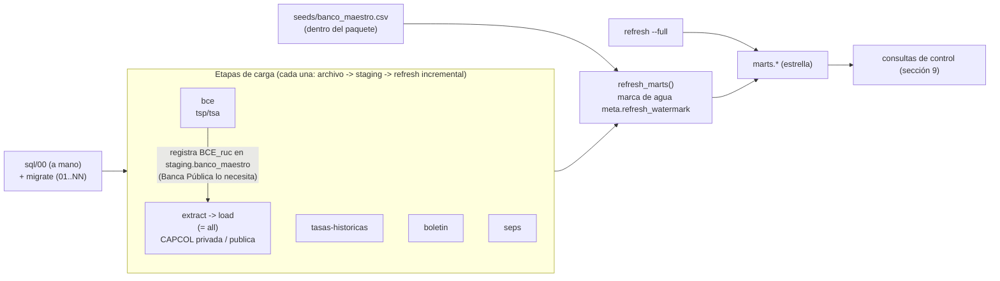

# Despliegue y orquestación — runbook

Cómo levantar **benchmark-bancos** desde cero en cualquier servidor (Linux o Windows, con
o sin Docker), apuntarlo a otra base Postgres, hacer la primera carga, operarlo de forma
incremental y programarlo. Al final, las brechas que hoy impiden o complican esa
portabilidad, con propuesta concreta.

Dueño: agente `platform-architect`. Se actualiza en el mismo cambio cada vez que cambia
una etapa del CLI, una variable de entorno, una migración `sql/NN_*.sql`, una fuente o
la forma de correr el pipeline.

**Convenciones**

- `<ruta-del-proyecto>`: el clon del repo en el servidor. `<ruta-de-logs>`,
  `<ruta-de-respaldos>`: directorios a elección, fuera del repo.
- Cada bloque indica su estado: **[verificado]** (corrido contra el código o una base
  real, 2026-10-09) o **[no probado]** (sintaxis revisada, no ejecutado). Verificado el
  2026-10-09: `migrate` sobre una base nueva `postgres:17` (aplica 01..38), segunda
  corrida "base al día", `migrate --baseline` sobre la base local existente,
  `migrate --status`, `actualizar` completo en Windows y el código 75 con otra sesión
  sosteniendo el bloqueo. Cambios de portabilidad del mismo día (verificados por quien los
  implementó): `postgres:17` con `POSTGRES_USER` distinto de `bp_etl` vía initdb (no se
  crea `bp_etl`; `meta`/`staging`/`marts` a nombre del rol configurado), `nombre_mes` en
  español sobre un servidor `en_US.utf8`, y `migrate` con sondas (baseline automático y
  `--baseline` parcial). La primera carga completa sobre una base nueva sigue descrita a
  partir del código (`src/benchmark_bancos/cli.py`, `pipeline.py`, `orquestacion.py`) y
  de CI (`.github/workflows/test.yml`).
- Los comandos usan `uv run benchmark-bancos <etapa>`. Equivalentes:
  `uv run main.py <etapa>` y `python -m benchmark_bancos <etapa>` (todos delegan en
  `benchmark_bancos.cli:main`).

---

## 1. Mapa del sistema

### 1.1 Componentes y requisitos

| Componente | Requisito | Notas |
|---|---|---|
| Python | 3.12 (`.python-version`, `requires-python = ">=3.12"`) | uv lo instala si falta |
| uv | probado con 0.8.x | dependencias exactas desde `uv.lock` |
| Postgres | 17 (CI y docker-compose usan `postgres:17`) | versiones anteriores no probadas |
| Cliente `psql` | solo para `sql/00` (superusuario) fuera de Docker; el resto lo aplica `benchmark-bancos migrate` | `pg_dump`/`pg_restore` para respaldos |
| Chromium (Playwright 1.63, fijado en `uv.lock`) | solo etapas `extract`, `all`, `boletin` | headless; en Linux requiere librerías del sistema (`--with-deps`) |
| Red saliente HTTPS | `superbancos.gob.ec`, `contenido.bce.fin.ec`, `estadisticas.seps.gob.ec` | URLs en `src/benchmark_bancos/config/sources.py` |
| Disco | ~2,2 GB `data/raw/**` + ~9,4 GB base (2026-10-05) + respaldos | `data/raw/**` es la fuente de verdad, respaldarlo |

### 1.2 Configuración (variables de entorno)

Todo lo que cambia entre servidores se lee de variables de entorno, con `.env` en la raíz
del proyecto como respaldo (`src/benchmark_bancos/config/settings.py`). docker-compose
lee el mismo `.env`.

| Variable | Default en código | Uso |
|---|---|---|
| `POSTGRES_HOST` | `localhost` | host de la base |
| `POSTGRES_PORT` | `5432` | puerto (docker-compose también lo usa para publicar el puerto) |
| `POSTGRES_DB` | `benchmark_cartera_depositos` | nombre de la base. Cualquier nombre (desde 2026-10-09 `sql/00` lo toma de aquí) |
| `POSTGRES_USER` | `bp_etl` | rol de la app. Cualquier nombre desde 2026-10-09 (brecha B2 resuelta): `sql/00` lo crea con este nombre y las migraciones 01..NN dejan los esquemas a nombre de quien las aplica. **`migrate` debe correr con este mismo rol**, no con un superusuario, para que sea dueño de `meta`/`staging`/`marts` |
| `POSTGRES_PASSWORD` | `changeme` | contraseña. Cambiarla en cualquier servidor real; `sql/00` la usa al crear el rol |
| `SCRAPER_YEARS` | `2021,2022,2023,2024,2025` | años por defecto de `--years` |
| `SCRAPER_DOWNLOAD_DIR` | `data/raw` | relativo a la raíz del proyecto; destino de descargas |
| `BENCHMARK_HOME` | (sin definir) | fija la raíz del proyecto. Si no está, se busca el primer directorio con `pyproject.toml` desde el cwd hacia arriba. Necesaria si el paquete se instala fuera del repo o el scheduler arranca en otro directorio |

Derivados (no configurables por separado): `data/raw/bce`, `data/raw/seps`,
`data/_tmp_extract` (temporal de descompresión, compartido por todas las etapas).

### 1.3 Etapas del CLI [verificado con `uv run benchmark-bancos --help`]

| Etapa | Qué hace | Red | Navegador | Opciones que respeta | Refresh de marts al final |
|---|---|---|---|---|---|
| `migrate` | aplica en orden los `sql/NN_*.sql` pendientes (excepto `sql/00`) y los anota en `meta.schema_migrations`; `--status` solo informa; `--baseline` registra sin ejecutar las migraciones hasta el nivel verificado por sondas; `--aceptar-cambios` actualiza el sha256 de migraciones ya aplicadas que se editaron a propósito (sección 3) | no | no | `--status`, `--baseline`, `--aceptar-cambios` | no |
| `actualizar` | actualización incremental de todas las fuentes, en orden `bce`, `capcol` (extract + load de ambos portales), `boletin`, `tasas-historicas`, `seps`; cada fuente aislada (si una falla, ERROR y sigue con las demás) | sí | sí (capcol, boletin) | `--fuentes`, `--years` (default: año en curso; en enero-febrero también el anterior). Ignora `--out` y `--portales` | sí (cada fuente hace el suyo) |
| `extract` | descarga ZIP de CAPCOL (re-descarga y sobrescribe todos los archivos de los años pedidos) | sí | sí | `--years`, `--out`, `--portales` | no |
| `load` | carga a staging los ZIP de CAPCOL ya descargados (salta por sha256) | no | no | `--years`, `--out`, `--portales` | sí |
| `all` | `extract` + `load` | sí | sí | `--years`, `--out`, `--portales` | sí |
| `bce` | descarga tsp/tsa **solo si no existen en disco** + carga | sí (si falta el archivo) | no | ninguna | sí |
| `tasas-historicas` | descarga los meses `TasasVigentesMMAAAA.htm` faltantes desde 2008-01 + carga | sí | no | ninguna | sí |
| `boletin` | descarga (siempre) + carga el Boletín Financiero | sí | sí | `--years`, `--out` | sí |
| `seps` | descarga los reportes del año **solo si la carpeta no tiene ZIP** + carga | sí (si falta) | no | `--years` (ignora `--out`) | sí |
| `refresh` | recalcula `marts.*` desde staging (incremental por marca de agua) | no | no | `--full` | es la etapa |
| `conciliar` | control saldos vs. contabilidad, solo lectura (sección 9) | no | no | `--meses` | no |

`--portales` acepta `privada` y/o `publica` (default: ambos). `--fuentes` acepta `bce`,
`capcol`, `boletin`, `tasas-historicas` y/o `seps`. `--log-file <archivo>` (todas las
etapas) escribe además el log en UTF-8. Una sola etapa por invocación.

### 1.3.1 Códigos de salida y bloqueo [verificado: `tests/test_orquestacion.py`]

| Código | Significado | Qué hacer |
|---|---|---|
| `0` | terminó sin ningún registro `ERROR` en el log | nada |
| `1` | excepción que cortó la corrida (red caída en una etapa suelta, error SQL, valor de catálogo no reconocido, migración fallida) | leer el log, corregir, volver a correr la misma etapa |
| `2` | terminó, pero se registraron `ERROR` (timeout de un scraper, una fuente de `actualizar` que falló) | leer el log; normalmente basta volver a correr |
| `75` | otra corrida tiene el bloqueo sobre la misma base; no se hizo nada | esperar y reintentar |

Todas las etapas que escriben en la base toman `pg_try_advisory_lock` (clave fija del
proyecto, `orquestacion.py:27`) en una conexión propia antes de empezar; cerrar la
conexión (fin del proceso, incluso si se mata) lo libera. Quedan fuera del bloqueo solo
`extract` y `migrate --status` (`cli.py:143`). Ojo: un `WARNING` no cambia el código
(archivos que no se pudieron parsear, carpetas de año faltantes; brecha B4).

### 1.4 Dependencias entre etapas



Reglas que salen del código:

1. **Todas las etapas requieren la base migrada** hasta el último `sql/NN`
   (`benchmark-bancos migrate --status` debe decir 0 pendientes).
2. **`bce` antes que CAPCOL `publica`** en una base nueva: Banca Pública resuelve su
   identidad a filas `BCE_<ruc>` que solo existen después de `bce`; si se carga antes,
   sus filas se descartan de `marts` sin error (solo un aviso en el log,
   `load_postgres.py:1025-1031`). Si ya pasó, `refresh --full` lo corrige. `actualizar`
   ya respeta este orden (`orquestacion.py:33`).
3. **Cada etapa de carga termina con `refresh_marts()`** (`pipeline.py:106, 174, 223,
   290, 375`): no hace falta correr `refresh` después de una etapa de carga.
4. **Una sola corrida a la vez** contra la misma base: el refresh incremental supone un
   único escritor (`load_postgres.py:1125-1127`) y todas las etapas comparten
   `data/_tmp_extract`. Desde 2026-10-09 el CLI lo garantiza con el bloqueo de 1.3.1: una
   segunda corrida sale con 75 sin tocar nada. No tiene sentido paralelizar etapas.

---

## 2. Instalación en un servidor nuevo

### 2.1 Linux sin Docker [no probado en Linux; mismos pasos que CI]

```bash
# Paquetes base (Debian/Ubuntu). En otras distros, equivalentes.
sudo apt-get update
sudo apt-get install -y git curl postgresql-client   # + postgresql-17 si la base va en este host

# uv (https://docs.astral.sh/uv/getting-started/installation/)
curl -LsSf https://astral.sh/uv/install.sh | sh

git clone <url-del-repo> <ruta-del-proyecto>
cd <ruta-del-proyecto>

# Dependencias exactas de uv.lock, sin el grupo dev (pytest/ruff/black) en producción
uv sync --locked --no-dev

# Chromium + librerías del sistema que necesita en un servidor sin GUI (headless).
# Solo hace falta si este servidor corre extract/all/boletin.
uv run --no-sync playwright install --with-deps chromium

cp .env.example .env
chmod 600 .env          # contiene la contraseña de la base
# editar .env: POSTGRES_HOST/PORT/DB/USER/PASSWORD (rol y base con el nombre que se quiera)
```

`psql` 15 o superior para `sql/00` si se quiere que tome rol/base/contraseña del entorno
(`\getenv`); con un `psql` más viejo, pasarlos con `-v` (sección 3.1).

### 2.2 Windows sin Docker [verificado en Windows 11 salvo la instalación de Postgres]

```powershell
# uv: https://docs.astral.sh/uv/getting-started/installation/
powershell -ExecutionPolicy ByPass -c "irm https://astral.sh/uv/install.ps1 | iex"

git clone <url-del-repo> <ruta-del-proyecto>
cd <ruta-del-proyecto>
uv sync --locked --no-dev
uv run --no-sync playwright install chromium
copy .env.example .env      # editar credenciales
```

Postgres 17 nativo: instalador oficial de PostgreSQL para Windows. `psql`, `pg_dump` y
`pg_restore` quedan en `C:\Program Files\PostgreSQL\17\bin\` (agregar al `PATH` o
invocarlos con ruta completa).

Recomendado en Windows: `PYTHONUTF8=1` en el entorno del usuario o de la tarea
programada, para que la consola y los logs no muestren acentos rotos (ver sección 10).

### 2.3 Postgres en Docker, ETL en el host [verificado: `docker compose config`]

```bash
cp .env.example .env    # (Windows: copy) -- ANTES de levantar el contenedor
docker compose up -d    # postgres:17, volumen bp_benchmark_pgdata, puerto ${POSTGRES_PORT:-5432}
docker compose ps       # esperar a "healthy"
```

En el **primer** arranque (volumen vacío) el contenedor crea el rol `POSTGRES_USER` y la
base `POSTGRES_DB` del `.env` (cualquier nombre), corre `sql/00` (no-op: ya existen) y
aplica `sql/01..NN` en orden lexicográfico vía `docker-entrypoint-initdb.d` como ese rol,
sin anotarlas en `meta.schema_migrations`. El primer `migrate` lo resuelve solo:
verifica con las sondas que la base está al día y la registra (**baseline automático**,
3.1); no hace falta `--baseline` a mano. En arranques posteriores el contenedor **no**
vuelve a aplicar nada: las migraciones nuevas se aplican con `migrate` (3.2).

Después, instalar el ETL en el host con 2.1 o 2.2 (con `POSTGRES_HOST=localhost`).

> Si en el mismo host ya hay un Postgres nativo en el puerto 5432, el contenedor y el
> nativo compiten por el puerto. Antes de concluir "la base está vacía" o "la base tiene
> datos", confirmar a cuál se está conectando:
> `SELECT version(), pg_postmaster_start_time();` (la versión dice `windows` o `linux`).

### 2.4 ETL en contenedor [no probado; no existe Dockerfile en el repo, ver brecha B9]

Imagen propuesta (guardar como `Dockerfile` si se decide adoptarla):

```dockerfile
FROM python:3.12-slim
COPY --from=ghcr.io/astral-sh/uv:0.8 /uv /usr/local/bin/uv
WORKDIR /app
ENV BENCHMARK_HOME=/app PYTHONUTF8=1 UV_LINK_MODE=copy
COPY pyproject.toml uv.lock README.md ./
COPY src ./src
COPY sql ./sql
RUN uv sync --locked --no-dev \
 && uv run --no-sync playwright install --with-deps chromium
ENTRYPOINT ["uv", "run", "--no-sync", "benchmark-bancos"]
```

Uso junto al Postgres de docker-compose (servicio `postgres`, red por defecto del
proyecto compose):

```bash
docker build -t benchmark-bancos-etl .
docker run --rm --network <proyecto>_default --env-file .env \
  -e POSTGRES_HOST=postgres -v "$PWD/data:/app/data" \
  benchmark-bancos-etl bce
```

`data/` debe ser un volumen persistente: ahí viven los archivos fuente y el hash de cada
uno está en `meta.source_files`.

### 2.5 Otra base de datos

- **Otro Postgres (gestionado o en otro host: RDS, Azure Database for PostgreSQL, Cloud
  SQL, etc.)**: portable sin cambios de código. Requisitos: `COPY ... FROM STDIN`
  (lo soportan todos los gestionados) y la extensión `plpgsql` (única usada, verificado
  en `pg_extension`). Desde 2026-10-09 ya no hace falta un rol llamado `bp_etl` (B2) ni
  `lc_time` en español (B5). Pasos [verificado 2026-10-09 simulando un servicio gestionado en `postgres:17`: admin `NOSUPERUSER CREATEROLE CREATEDB`, `sql/00` desde el psql del host y `migrate` con el rol de la app; no probado contra un proveedor real]:
  1. Rol y base, una de dos:
     - **usar el rol y la base que entrega el proveedor**: poner sus nombres en
       `POSTGRES_USER`/`POSTGRES_DB` y saltar `sql/00`. El rol necesita poder crear
       esquemas en esa base (dueño de la base, o `GRANT CREATE ON DATABASE`);
     - **crear un rol propio** con `sql/00` parametrizado (3.1), conectado con el usuario
       administrador del servicio (los gestionados no dan superusuario, pero su admin
       tiene `CREATEROLE`/`CREATEDB`). En Postgres 16+, `CREATE DATABASE ... OWNER <rol>`
       exige que el admin pueda asumir ese rol ("must be able to SET ROLE"): `sql/00` ya
       se otorga esa membresía solo cuando quien lo corre no es superusuario
       (`GRANT <rol> TO <admin> WITH SET TRUE`; antes de 16, `GRANT` simple) [verificado].
  2. `benchmark-bancos migrate` **con el rol de la app** (el del `.env`), nunca con el
     admin: los esquemas quedan a nombre de quien ejecuta. `migrate` no necesita
     superusuario (ninguna migración 01..NN crea extensiones ni roles).
  Si el proveedor exige TLS, hoy no hay variable para `sslmode` (brecha B10).
- **Otro motor (SQL Server, Databricks/Delta, Snowflake)**: **no portable sin un
  adaptador**. Toda la capa de carga es SQL de Postgres (`COPY`, `ON CONFLICT`,
  `IS DISTINCT FROM`, tablas temporales `ON COMMIT DROP`, `DO $$`, y en `sql/00`
  `\gexec`/`\getenv`/`\if` de psql). El inventario construcción por construcción, con su equivalente en
  SQL Server y Databricks/Delta, está en `docs/architecture.md`, sección "Portabilidad de
  motor". Para BI sobre otro motor, lo práctico es replicar `marts.*` (pg_dump, Parquet
  como `scripts/export_sample_parquet.py`, o CDC del motor) en vez de portar el ETL.

---

## 3. Base de datos y migraciones

Desde 2026-10-09 las migraciones se aplican con `benchmark-bancos migrate`
(`src/benchmark_bancos/migrate.py`), que lleva el registro en `meta.schema_migrations`
(`archivo`, `sha256`, `aplicada_en`, `modo` = `aplicada` | `baseline`; `sql/38`):

- aplica **solo los pendientes**, en orden lexicográfico, uno por uno (cada archivo se
  envía completo en autocommit y se anota al terminar); si uno falla, sale con código 1 y
  los anteriores quedan aplicados y registrados (corregir y volver a correr `migrate`);
- **excluye `sql/00_roles_db.sql`** (crea rol y base; necesita superusuario o un admin con
  `CREATEROLE`/`CREATEDB`): se corre a mano una vez, o lo hace docker-compose;
- **no nombra ningún rol**: desde 2026-10-09 `sql/01`, `02`, `03`, `33` y `34` crean los
  esquemas sin `AUTHORIZATION bp_etl`, así que `meta`/`staging`/`marts` quedan a nombre
  del rol que corre `migrate` (el `POSTGRES_USER` del `.env`). Correrlo siempre con el rol
  de la app, no con `postgres`;
- **sondas** (`migrate.py`: `SONDAS` y `nivel_verificado`): cada migración desde la 28
  declara una consulta que es verdadera si su efecto ya está en la base. El **nivel
  verificado** es la última migración N tal que todas las sondas hasta N pasan. Se usan
  solo cuando la base **ya tiene esquema pero el registro está vacío** (base armada por
  docker-compose o CI, que aplican `sql/` con `psql`, o base anterior a 2026-10-09):
  - nivel = última migración → **baseline automático**: registra todo como `baseline` y
    sigue (caso docker-compose/CI: no hace falta intervenir);
  - nivel anterior a la última → sale con código 1 indicando el nivel y pide
    `--baseline`, que registra **solo hasta ese nivel**; el resto queda pendiente para el
    `migrate` siguiente;
  - ninguna sonda pasa (base anterior a 2026-09, cuando no existía `sql/28`, o base ajena)
    → código 1: revisar a mano (3.3);
- si un archivo ya aplicado **cambió** (sha256 distinto) avisa con `WARNING` en cada
  corrida y **no** lo vuelve a ejecutar. Si el cambio fue a propósito y no altera el
  resultado, `migrate --aceptar-cambios` actualiza el sha256 registrado (sin re-ejecutar);
- muestra en el log los `RAISE NOTICE` propios de las migraciones (p. ej. el de `sql/36`
  que pide reprocesar el BCE) y oculta el ruido de `IF [NOT] EXISTS ..., skipping`;
- toma el bloqueo de 1.3.1 (salvo `--status`), así que no corre en medio de una carga.
  `--status` es de solo lectura: no crea el registro si falta, y avisa con `WARNING` si
  la base tiene esquema y el registro está vacío.

### 3.1 Base nueva

**Paso 1: rol y base (`sql/00`, una vez, como superusuario o admin).** Desde 2026-10-09
el archivo toma rol, base y contraseña, en este orden, de: variables de psql
(`-v app_user=... -v app_db=... -v app_password=...`), variables de entorno
`POSTGRES_USER`/`POSTGRES_DB`/`POSTGRES_PASSWORD` (vía `\getenv`, **requiere psql 15 o
superior**), o los defaults `bp_etl`/`benchmark_cartera_depositos`/`changeme`. Es
idempotente: si el rol o la base ya existen no hace nada (tampoco cambia la contraseña de
un rol existente).

Linux/macOS, tomando todo del `.env` [no probado con psql fuera de un contenedor; la
lectura desde el entorno se verificó en el initdb de `postgres:17`]:

```bash
set -a; . ./.env; set +a          # exporta POSTGRES_USER/DB/PASSWORD: sql/00 los lee con \getenv
psql -h "$POSTGRES_HOST" -p "$POSTGRES_PORT" -U postgres -d postgres -v ON_ERROR_STOP=1 -f sql/00_roles_db.sql
```

Con psql < 15 (sin `\getenv`), o para no depender del entorno, pasar los nombres con
`-v` [no probado]:

```bash
psql -h "$POSTGRES_HOST" -p "$POSTGRES_PORT" -U postgres -d postgres -v ON_ERROR_STOP=1 \
     -v app_user="$POSTGRES_USER" -v app_db="$POSTGRES_DB" -v app_password="$POSTGRES_PASSWORD" \
     -f sql/00_roles_db.sql
```

Windows (PowerShell) [verificado 2026-10-09, con `-v` y con variables de entorno]:

```powershell
$psql = "C:\Program Files\PostgreSQL\17\bin\psql.exe"
& $psql -h localhost -p 5432 -U postgres -d postgres -v ON_ERROR_STOP=1 `
        -v app_user=<rol-del-.env> -v app_db=<base-del-.env> -v app_password=<clave-del-.env> `
        -f sql/00_roles_db.sql
```

Sin `-v` ni variables de entorno se crean `bp_etl` con contraseña `changeme`: cambiarla
después con `ALTER ROLE bp_etl PASSWORD '...'`. En un Postgres gestionado se puede saltar
este paso y usar el rol que entrega el proveedor (2.5).

**Paso 2: migraciones 01..NN como el rol de la app** [verificado 2026-10-09 sobre una
base nueva `postgres:17`: `migrate` aplicó todas y una segunda corrida dijo "base al
día"]:

```bash
uv run --no-sync benchmark-bancos migrate
uv run --no-sync benchmark-bancos migrate --status     # "N aplicadas, 0 pendientes"
```

**Con Docker**: `docker compose up -d` sobre un volumen vacío crea rol y base desde el
`.env` y aplica todo `sql/` con `psql` (2.3), sin registro. El primer `migrate` hace el
baseline automático [verificado 2026-10-09 con `postgres:17` inicializado como lo hace
docker-compose y con el `docker compose up` del repo (rol `etl_compose`, otro
puerto y nombre de proyecto para no tocar la base local)]:

```bash
uv run --no-sync benchmark-bancos migrate          # log: "Baseline automático (base al día): N migraciones registradas ..."
uv run --no-sync benchmark-bancos migrate --status # 0 pendientes
```

Lo mismo vale para una base armada con el bucle `psql` de CI. **CI verifica portabilidad
de rol**: el job de integración usa un rol distinto de `bp_etl`, aplica `sql/` con `psql`
y después corre `benchmark-bancos migrate` (baseline automático) y comprueba que queden
0 pendientes (`.github/workflows/test.yml`).

### 3.2 Base existente: aplicar solo las migraciones nuevas

> **Nunca re-aplicar todo `sql/` con `psql` sobre una base con datos.** Las migraciones
> no son re-ejecutables: `sql/14` vacía `staging.bce_tasas_*` y borra su registro en
> `meta.source_files`; `sql/07`, `09`, `20` y `28` hacen `TRUNCATE` de tablas de hechos;
> `sql/10` borra filas; `sql/15`, `16` y `21` renombran o eliminan tablas y fallan (o
> peor) en una segunda pasada. `migrate` existe para evitarlo.

**Base ya registrada antes de 2026-10-09 (una vez, tras actualizar el repo).** Ese día se
editaron `sql/01`, `02`, `03`, `33` y `34` (se quitó `AUTHORIZATION bp_etl`; en una base
existente no cambia nada: los esquemas siguen a nombre del rol que los creó). Hasta
aceptar el cambio, `migrate` y `migrate --status` avisan `Migración ya aplicada cuyo
archivo cambió después` por cada una:

```bash
uv run --no-sync benchmark-bancos migrate --aceptar-cambios   # actualiza el sha256, no re-ejecuta; luego aplica lo pendiente
uv run --no-sync benchmark-bancos migrate --status            # 0 pendientes, sin WARNING
```

[`--aceptar-cambios` verificado por quien lo implementó; en esta revisión solo se
comprobó que la base local, ya actualizada, da "40 aplicadas, 0 pendientes" sin avisos.]
`--aceptar-cambios` acepta **todos** los archivos modificados a la vez: usarlo solo si el
cambio fue a propósito (revisar antes con `git log -p -- sql/NN_<nombre>.sql`).

**Base con esquema y sin registro, a medio migrar** (base anterior a 2026-10-09 que nunca
pasó por `migrate`, o un respaldo viejo restaurado) [verificado 2026-10-09: base
aplicada hasta `sql/36` → `migrate` falló con "nivel verificado es 36_codigos_inec.sql",
`--baseline` registró hasta la 36 y el `migrate` siguiente aplicó 37-40]:

```bash
uv run --no-sync benchmark-bancos migrate --status     # WARNING: registro vacío
uv run --no-sync benchmark-bancos migrate              # código 1: "... su nivel verificado es NN_..."
uv run --no-sync benchmark-bancos migrate --baseline   # registra hasta NN; log: "Quedan pendientes para el próximo `migrate`: ..."
uv run --no-sync benchmark-bancos migrate              # aplica las que quedaron pendientes
```

El baseline cubre también las migraciones **sin sonda** (todas las anteriores a la 28, y
`sql/30`, `32` y `35`, migraciones de datos idempotentes que caen entre dos sondas). Si
`migrate` dice que ni la primera sonda pasa, la base es anterior a 2026-09: compararla a
mano con `sql/` (3.3), aplicar lo que falte con `psql -v ON_ERROR_STOP=1 -f
sql/NN_<nombre>.sql` hasta pasar al menos la 28, y recién entonces `--baseline`.

**Cada despliegue** (registro ya sembrado):

1. Respaldo previo (sección 8).
2. `git pull` y `uv run --no-sync benchmark-bancos migrate --status`: lista los
   pendientes por nombre y avisa si algún archivo aplicado cambió.
3. Leer el encabezado de cada pendiente: algunas exigen un reproceso o un
   `refresh --full` después.
4. `uv run --no-sync benchmark-bancos migrate`. Revisar en el log los `NOTICE` de cada
   archivo y cualquier `WARNING` de "archivo cambió" (si el cambio fue intencional y así
   lo indica el commit, `migrate --aceptar-cambios`).
5. Si la migración lo pide, el reproceso indicado; si no dice nada, correr
   `uv run benchmark-bancos refresh --full` es seguro.

Con el Postgres de docker-compose el procedimiento es el mismo desde el host
(`POSTGRES_HOST=localhost`); no hace falta `docker compose exec`.

Migraciones de 2026-10-09 (35 a 40):
- `sql/35`: fusiona 2 cantones duplicados. No requiere nada después.
- `sql/36`: códigos INEC y fusión de 5 pares con provincia anterior. **Si emite el
  NOTICE `filas BCE con provincia anterior borradas`, correr `uv run benchmark-bancos
  bce`** (reprocesa tsp/tsa con el alias, ~5 min, sin volver a descargar).
- `sql/37`: renombra `marts.dim_banco` → `marts.dim_entidad` y `banco_id` →
  `entidad_id`. Cualquier consulta o reporte externo que use los nombres viejos debe
  actualizarse.
- `sql/38`: crea `meta.schema_migrations` (mismo DDL que `_DDL_REGISTRO` en
  `migrate.py`). En bases armadas con `psql` queda vacía hasta el primer `migrate`
  (baseline automático).
- `sql/39`: vistas de conciliación saldos vs. contabilidad (sección 9). Nada después.
- `sql/40`: corrige `marts.dim_fecha.nombre_mes` a español en bases cargadas sobre un
  servidor con `lc_time` en otro idioma (antes salía `January`); en un servidor en
  español no cambia nada. Desde ese día `refresh_marts()` usa una lista fija de meses
  (`load/load_postgres.py`, `_REFRESH_MARTS_SQL`), sin depender del locale. Nada después.

### 3.2.1 Agregar una migración nueva (desarrollo)

1. Crear `sql/NN_<descripcion>.sql` con el número siguiente. **Sin nombres de rol**
   (`AUTHORIZATION`, `OWNER TO`, `GRANT ... TO <rol>`): los objetos quedan a nombre de
   quien aplica. Encabezado que diga qué hace y si requiere reproceso o `refresh --full`.
2. **Agregar su sonda en `SONDAS`** (`src/benchmark_bancos/migrate.py`): un `SELECT
   <booleano>` verdadero cuando el efecto de la migración está en la base **y que lo siga
   siendo después de todas las siguientes** (p. ej. `to_regclass(...) IS NOT NULL`, una
   columna en `information_schema.columns`). Una migración de datos idempotente sin efecto
   verificable puede quedar sin sonda agregándola a `_SIN_SONDA` en el test, pero **la
   última migración siempre necesita sonda** (el baseline automático compara contra
   ella). `tests/test_orquestacion.py::test_toda_migracion_desde_la_28_tiene_sonda` lo
   exige y corre sin base.
3. Probar sobre una base de desarrollo: `migrate`, y que `migrate --status` dé 0
   pendientes. Con base de integración: `uv run pytest -m integration
   tests/test_orquestacion.py` (nunca contra producción, ver sección 10).
4. Agregarla a la lista "Migraciones de ..." de 3.2 y actualizar este runbook si cambia
   la operación.
5. No editar migraciones ya aplicadas. Si hace falta (un cambio sin efecto sobre el
   resultado, como el de 2026-10-09), avisar en el commit que cada base existente debe
   correr `migrate --aceptar-cambios` una vez.

### 3.3 ¿Hasta qué migración está la base? [verificado contra la base local]

Con registro (desde 2026-10-09):

```sql
SELECT archivo, modo, aplicada_en FROM meta.schema_migrations ORDER BY archivo DESC LIMIT 5;
SELECT modo, count(*) FROM meta.schema_migrations GROUP BY modo;
```

`migrate --status` da lo mismo contrastado contra `sql/` (2026-10-09, base local: "40
aplicadas, 0 pendientes").

Sin registro, `migrate` calcula el nivel con las sondas y lo dice en su mensaje de error.
Para inspeccionar a mano, las sondas son consultas de solo lectura (texto completo en
`SONDAS`); por ejemplo:

```sql
SELECT to_regclass('meta.schema_migrations') IS NOT NULL                 AS sql38_aplicada,
       to_regclass('marts.dim_entidad') IS NOT NULL                       AS sql37_aplicada,
       to_regclass('meta.refresh_watermark') IS NOT NULL                  AS sql34_aplicada,
       to_regnamespace('raw') IS NULL                                     AS sql33_aplicada;
```

Dueño de los esquemas (debe ser el rol de la app) [no probado]:

```sql
SELECT nspname, pg_get_userbyid(nspowner) AS duenio
FROM pg_namespace WHERE nspname IN ('meta', 'staging', 'marts');
```

---

## 4. Primera carga completa

Orden recomendado para una base recién migrada (respeta la regla 2 de 1.4). Todas son
idempotentes: si una falla, se corrige y se vuelve a correr la misma etapa.

```bash
uv run benchmark-bancos bce                                            # 1. tsp/tsa 2008-hoy (identidad BCE_<ruc>)
uv run benchmark-bancos tasas-historicas                               # 2. techos/referenciales mensuales
uv run benchmark-bancos all --years 2021 2022 2023 2024 2025 2026      # 3. CAPCOL privada + publica
uv run benchmark-bancos boletin --years 2021 2022 2023 2024 2025 2026  # 4. Boletín
uv run benchmark-bancos seps --years 2021 2022 2023 2024 2025 2026     # 5. SEPS (solo años con download_id)
uv run benchmark-bancos refresh --full                                 # 6. red de seguridad: marts desde todo staging
```

Equivalente en una sola invocación [no probado como primera carga; mismo orden, cada
fuente aislada, código 2 si alguna falló]:

```bash
uv run benchmark-bancos actualizar --years 2021 2022 2023 2024 2025 2026 --log-file <ruta-de-logs>/primera_carga.log
uv run benchmark-bancos refresh --full
```

- El primer refresh de una base nueva es completo (no hay marca de agua); los siguientes
  son incrementales. Un refresh completo tarda ~3 min en la base de 2026-10 (medido en
  `docs/architecture.md`, "Carga incremental"); el resto de tiempos no está medido.
- `--years` también se puede fijar con `SCRAPER_YEARS` en `.env` (no aplica a
  `actualizar`, cuyo default es el año en curso).
- SEPS solo descarga años presentes en `SEPS_DOWNLOAD_IDS`
  (`src/benchmark_bancos/config/sources.py:55-64`, hoy 2021-2026); otros años se omiten
  con un aviso.

**Reconstruir desde archivos ya descargados** (servidor sin acceso a los portales, o
restaurar sin respaldo de la base): copiar `data/raw/**` al servidor nuevo y correr

```bash
uv run benchmark-bancos bce                        # petición condicional al BCE: sin red falla (download_bce.py:68-78, brecha B7)
uv run benchmark-bancos load --years 2021 2022 2023 2024 2025 2026   # CAPCOL sin navegador
uv run benchmark-bancos seps --years 2021 2022 2023 2024 2025 2026   # hace HEAD al portal: necesita red (brecha B7)
uv run benchmark-bancos tasas-historicas           # intenta descargar los meses que falten: necesita red
uv run benchmark-bancos refresh --full
```

El Boletín no tiene modo "solo cargar": `boletin` siempre abre el portal antes de cargar
(`pipeline.py:336`, brecha B7). `actualizar` siempre descarga: no sirve para reconstruir
sin red.

---

## 5. Operación incremental recurrente

### 5.1 Qué publica cada fuente y cómo se recoge lo nuevo

| Fuente | Cadencia de la fuente | Cómo se detecta lo nuevo | Fuente en `actualizar --fuentes` |
|---|---|---|---|
| BCE tsp/tsa | semanal (un ZIP acumulado 2008-hoy) | descarga condicional con `ETag`/`Last-Modified` guardados en `<zip>.meta.json`; si el servidor responde 304 no baja nada, y si el contenido no cambió el sha256 evita reprocesar | `bce` |
| BCE TasasHistorico | mensual (una página por mes) | descarga los meses que faltan en disco | `tasas-historicas` |
| CAPCOL privada / publica | mensual | re-descarga los años pedidos (pocos MB); carga solo ZIP con sha256 nuevo | `capcol` |
| Boletín | mensual | re-descarga los años pedidos; carga solo ZIP con sha256 nuevo | `boletin` |
| SEPS | anual por archivo (S1-S3 y mutualistas); el año en curso se republica cada mes con el mismo `download_id` | HEAD al link del portal y comparación contra `data/raw/seps/<año>/<reporte>/_descarga.json`; si hay versión nueva la baja y reemplaza. Un año nuevo requiere agregar sus `download_id` en `config/sources.py` | `seps` |

`actualizar` usa por defecto el **año en curso, y en enero y febrero también el
anterior** (`orquestacion.py:68-72`): diciembre y el cierre anual se publican ya entrado
el año siguiente. Fuera de esa ventana, un mes rezagado del año anterior se recoge con
`actualizar --years <año-anterior> <año-actual>`.

### 5.2 Corrida tipo [verificado en Windows 2026-10-09: todas las fuentes OK, ~1,5 min sin novedades]

```bash
cd <ruta-del-proyecto>
uv run --no-sync benchmark-bancos actualizar --log-file logs/actualizar_manual.log
echo $?      # 0, 2 o 75 (1.3.1)
```

Solo algunas fuentes: `actualizar --fuentes bce seps`. Las etapas sueltas (`bce`,
`all --years ...`, etc.) siguen disponibles y equivalen a una fuente de `actualizar`.

**Por qué una corrida semanal alcanza**: la fuente más frecuente (BCE tsp/tsa) publica
una vez por semana; las demás son mensuales y se recogen en la corrida siguiente a su
publicación (a lo sumo una semana de rezago). Correr seguido es barato: BCE y SEPS solo
descargan si el servidor tiene versión nueva, TasasHistorico solo baja meses faltantes, y
CAPCOL/Boletín vuelven a bajar los archivos del año pero no recargan los de sha256 ya
registrado; el refresh incremental solo toca lo que cambió. Correrlo a diario no rompe
nada, solo repite las descargas de CAPCOL/Boletín.

`--no-sync` evita que `uv` intente reinstalar dependencias en cada corrida programada
(se instalan una vez con `uv sync --locked --no-dev`).

---

## 6. Ejecución por partes

| Necesito... | Comando |
|---|---|
| Todas las fuentes, incremental | `actualizar` |
| Una o varias fuentes | `actualizar --fuentes bce seps` (o las etapas sueltas `bce`, `tasas-historicas`, `boletin`, `seps`, `all`) |
| Un año | `--years 2026` (en `actualizar`, `extract`, `load`, `all`, `boletin`, `seps`) |
| Varios años | `--years 2024 2025 2026` |
| Un portal CAPCOL | `all --portales publica` (o `privada`) |
| Solo descargar CAPCOL, cargar después | `extract --years 2026` y luego `load --years 2026` |
| Cargar CAPCOL desde otro directorio | `load --out <dir>` (debe tener la estructura `<dir>/<año>/{cartera,depositos}/*.zip` y `<dir>/banca_publica/...`) |
| Solo recalcular marts de lo cambiado | `refresh` |
| Recalcular todos los marts | `refresh --full` |
| Ver migraciones pendientes / aplicarlas | `migrate --status` / `migrate` |
| Guardar el log en un archivo | `--log-file <archivo>` (cualquier etapa) |

No existen hoy: elegir un mes, una tabla de marts, un `--dry-run`, ni "solo cargar" para
el Boletín (brechas B7, B11).

### 6.1 Qué etapa correr según qué cambió

| Qué cambió | Qué correr | Por qué |
|---|---|---|
| CAPCOL publicó un mes nuevo | `all --years <año>` (o `--portales privada`/`publica`) | ZIP nuevo o con hash distinto → carga + refresh incremental |
| BCE publicó una semana nueva | `bce` | la descarga condicional detecta la versión nueva y la reemplaza |
| BCE publicó TasasHistorico de un mes nuevo | `tasas-historicas` | descarga solo meses faltantes |
| Superbancos publicó un Boletín nuevo | `boletin --years <año>` | idem CAPCOL |
| SEPS publicó un año nuevo | agregar el año en `SEPS_DOWNLOAD_IDS` (`config/sources.py`) + `seps --years <año>` | sin id no hay descarga |
| SEPS publicó un mes más del año en curso | `seps --years <año>` | la descarga condicional detecta la versión nueva |
| Se editó `seeds/banco_maestro.csv` (nombre o tipo de entidad) | `refresh` | el seed se re-siembra al inicio de cada refresh; `dim_entidad` se actualiza |
| Se editó `seeds/banco_crosswalk.csv` o un `*_matching.py`/parser | reprocesar los archivos afectados: hoy exige borrar su fila en `meta.source_files` (operación destructiva, coordinar con `data-engineer`) y volver a correr la etapa | el gate por sha256 salta archivos ya cargados aunque el código cambie (brecha B8) |
| Se aplicó una migración que cambia la lógica de refresh | `refresh --full` | el incremental solo ve filas de staging con `fecha_actualizacion` nueva |
| Se cargó CAPCOL `publica` antes que `bce` en una base nueva | `refresh --full` | ver regla 2 de 1.4 |
| Un refresh se interrumpió (o hubo dos corridas simultáneas antes de 2026-10-09) | `refresh --full` | la marca de agua supone un solo escritor; desde 2026-10-09 el bloqueo impide corridas simultáneas |
| Se agregó un `sql/NN` nuevo | `migrate` (y lo que pida su encabezado) | sección 3.2 |
| Se curó a mano un catálogo (`estado_validacion`) | nada (o `refresh` si se tocó staging) | marts lee el estado tal cual |

---

## 7. Programación

Una sola tarea **semanal** que corre `benchmark-bancos actualizar` (todas las fuentes;
por qué alcanza: 5.2). Los scripts de `scripts/` resuelven la parte del sistema operativo:
raíz del proyecto, log por corrida, limpieza de logs viejos y propagación del código de
salida.

### 7.1 Reglas comunes (cualquier scheduler)

1. **Exclusión mutua**: la pone el CLI (bloqueo en Postgres, 1.3.1). Una segunda
   corrida sobre la misma base sale con `75` sin tocar nada, venga del mismo scheduler,
   de otro servidor o de una consola. Conviene igual que el scheduler no apile
   instancias (`IgnoreNew`, `concurrencyPolicy: Forbid`, `max_active_runs=1`).
2. **Logs a archivo**: `--log-file <archivo>` escribe en UTF-8 con un `run_id` de 8
   caracteres por corrida (`logging_utils.py`). Los scripts lo dejan en
   `logs/actualizar_AAAAMMDD_HHMMSS.log` (en `.gitignore`) y borran los de más de 90 días.
3. **Códigos de salida** (1.3.1): alertar si es `1` o `2`; `75` es informativo (otra
   corrida en curso). `0` no garantiza que todo se haya cargado: archivos que no se
   pudieron parsear y carpetas de año faltantes solo dejan `WARNING` (brecha B4); revisar
   `grep -E " (WARNING|ERROR) "` en el log y las consultas de la sección 9.
4. **Cuidado al detenerla**: matar una corrida a mitad deja la transacción en curso sin
   commit (se revierte) y los archivos ya commiteados registrados; el bloqueo se libera
   al morir el proceso. Volver a correr es seguro.
5. **Después de un despliegue**: correr `migrate` (3.2) antes de la próxima corrida.
   `actualizar` no aplica migraciones.

### 7.2 Windows: Programador de tareas [verificado 2026-10-09: tarea registrada y ejecutada en Windows 11]

`scripts/actualizar.ps1` corre `uv run --no-sync benchmark-bancos actualizar --log-file
logs\actualizar_<fecha>.log` desde la raíz del proyecto (con `PYTHONUTF8=1`), borra los
logs de más de 90 días y termina con el código del CLI. Acepta `-Fuentes`:

```powershell
powershell -NoProfile -ExecutionPolicy Bypass -File scripts\actualizar.ps1
powershell -NoProfile -ExecutionPolicy Bypass -File scripts\actualizar.ps1 -Fuentes bce,seps
```

`scripts/registrar_tarea.ps1` registra (o reemplaza) la tarea `benchmark-bancos
actualizar`: semanal, por defecto lunes 07:30 (`-Dia`, `-Hora`), con el usuario actual y
solo con la sesión iniciada (no guarda contraseña), `StartWhenAvailable` (si el equipo
estaba apagado, corre al encenderlo), `MultipleInstances IgnoreNew` y límite de 3 h.

```powershell
powershell -NoProfile -ExecutionPolicy Bypass -File scripts\registrar_tarea.ps1                # lunes 07:30
powershell -NoProfile -ExecutionPolicy Bypass -File scripts\registrar_tarea.ps1 -Dia Tuesday -Hora 06:00
Start-ScheduledTask -TaskName 'benchmark-bancos actualizar'                                     # correr ahora
Get-ScheduledTaskInfo -TaskName 'benchmark-bancos actualizar'   # LastTaskResult = código de salida
Unregister-ScheduledTask -TaskName 'benchmark-bancos actualizar' -Confirm:$false               # quitarla
```

En un servidor **sin sesión iniciada** hay que registrar la tarea con otra cuenta o
"Ejecutar tanto si el usuario inició sesión como si no" (propiedades de la tarea, o
`Register-ScheduledTask -User ... -Password ...`) [no probado]; el script de registro no
lo cubre.

Verificado 2026-10-09: `Start-ScheduledTask` corrió `actualizar` completo (~1,5 min, sin
novedades en las fuentes) y `Get-ScheduledTaskInfo` mostró `LastTaskResult = 0`.

> **Si se edita `actualizar.ps1`**: en Windows PowerShell 5.1 (el `powershell.exe` de la
> tarea), con `$ErrorActionPreference = 'Stop'` y la salida redirigida (`*> $null`), cada
> línea que el CLI escribe en stderr (ahí va el logging) se convierte en un
> `NativeCommandError` que corta el script con código 1 aunque la corrida termine bien.
> Por eso el script baja a `'Continue'` solo alrededor de la llamada a `uv`. No quitar
> ese cambio.

### 7.3 Linux / macOS: cron [no probado]

`scripts/actualizar.sh` es el equivalente (mismos códigos, log en
`logs/actualizar_<fecha>.log`, limpieza de 90 días); recibe las fuentes como argumentos
(`scripts/actualizar.sh bce seps`). No necesita `flock`: el bloqueo vive en Postgres.

`crontab -e`:

```cron
# cron arranca con un PATH mínimo: uv suele estar en ~/.local/bin (poner la ruta absoluta)
PATH=<home-del-usuario>/.local/bin:/usr/local/bin:/usr/bin:/bin
# lunes 07:30
30 7 * * 1  <ruta-del-proyecto>/scripts/actualizar.sh
```

Sin esa línea `PATH`, `uv` no se encuentra, el script sale con 127 y, como descarta la
salida de consola, **no queda ningún log** (el archivo lo crea el CLI). Para recibir un
correo de cron cuando falla: `30 7 * * 1  <ruta-del-proyecto>/scripts/actualizar.sh ||
echo "benchmark-bancos: codigo $?"` (cron envía por correo cualquier salida).

### 7.4 Contenedor programado [no probado]

Con la imagen de 2.4, el scheduler del host (cron / Programador de tareas) invoca
`docker run --rm ... benchmark-bancos-etl actualizar --log-file /app/data/logs/actualizar.log`
en lugar de `uv run`. En Kubernetes, un `CronJob` semanal con `concurrencyPolicy: Forbid`
y un volumen persistente montado en `/app/data`; el bloqueo en Postgres protege igual si
dos pods coinciden.

### 7.5 Airflow / Prefect / Dagster (opcional) [no probado]

No hacen falta a la cadencia actual (semanal, un solo responsable; ver
`docs/propuesta_escalabilidad_etl.md` §1.5). Si se adopta uno, cada fuente es una tarea
que llama a `benchmark-bancos actualizar --fuentes <fuente>`, y el orquestador aporta
reintentos, historial y alertas. Tratar `75` como "reintentar más tarde" y `1`/`2` como
fallo de la tarea. Ejemplos mínimos:

Airflow (2.x):

```python
# dags/benchmark_bancos_semanal.py -- NO PROBADO
from datetime import datetime, timedelta
from airflow import DAG
from airflow.operators.bash import BashOperator

CMD = "cd <ruta-del-proyecto> && uv run --no-sync benchmark-bancos actualizar --fuentes "
FUENTES = ["bce", "capcol", "boletin", "tasas-historicas", "seps"]  # bce primero (regla 2 de 1.4)
with DAG("benchmark_bancos_semanal", start_date=datetime(2026, 1, 1),
         schedule="30 7 * * 1", catchup=False, max_active_runs=1) as dag:
    tareas = [BashOperator(task_id=f.replace("-", "_"), bash_command=CMD + f,
                           retries=1, retry_delay=timedelta(minutes=10),
                           trigger_rule="all_done")   # como actualizar: si una falla, sigue
              for f in FUENTES]
    for a, b in zip(tareas, tareas[1:]):
        a >> b            # secuencial: un solo escritor
```

Prefect (2.x/3.x):

```python
# NO PROBADO
import subprocess
from prefect import flow, task

@task(retries=2, retry_delay_seconds=600)
def fuente(nombre: str) -> None:
    subprocess.run(["uv", "run", "--no-sync", "benchmark-bancos", "actualizar",
                    "--fuentes", nombre], cwd="<ruta-del-proyecto>", check=True)

@flow
def semanal() -> None:
    for f in ["bce", "capcol", "boletin", "tasas-historicas", "seps"]:
        fuente.submit(f).wait()   # secuencial; un fallo no corta las siguientes
```

Dagster: el mismo patrón con un `@op` por fuente que llama a `subprocess.run(...,
check=True)` y un `@job` que las encadena; `run_queue` con `max_concurrent_runs: 1`.

Llamar al CLI por subprocess (no importar `benchmark_bancos.pipeline` dentro del worker)
mantiene aislado el entorno de uv y el `.env` del proyecto.

---

## 8. Respaldo y restauración

### 8.1 Qué respaldar

1. **La base** (`pg_dump`): ~9,4 GB en disco (2026-10-05).
2. **`data/raw/**`** (~2,2 GB): es la fuente de verdad y permite reconstruir staging y
   marts sin red (sección 4). Algunos archivos históricos podrían dejar de estar
   publicados, así que no depender de re-descargar.
3. **`.env`** (fuera de git, guardar en el gestor de secretos).

### 8.2 Respaldo [verificado: `pg_dump -Fc` y `pg_restore --list` contra la base local]

```bash
set -a; . ./.env; set +a; export PGPASSWORD="$POSTGRES_PASSWORD"
pg_dump -h "$POSTGRES_HOST" -p "$POSTGRES_PORT" -U "$POSTGRES_USER" -d "$POSTGRES_DB" \
        -Fc -f "<ruta-de-respaldos>/benchmark_$(date +%Y%m%d).dump"
pg_restore --list "<ruta-de-respaldos>/benchmark_$(date +%Y%m%d).dump" | head   # comprobar que se puede leer
```

Con docker-compose:

```bash
docker compose exec -T postgres sh -c 'pg_dump -U "$POSTGRES_USER" -d "$POSTGRES_DB" -Fc' \
  > "<ruta-de-respaldos>/benchmark_$(date +%Y%m%d).dump"      # [no probado]
```

Respaldo liviano solo del control de ingesta (útil antes de tocar `meta.source_files`):
`pg_dump ... -Fc -t meta.source_files -t meta.refresh_watermark -f meta.dump`
[verificado].

### 8.3 Restauración [no probado]

En una base **vacía** (recién creada con `sql/00`, sin aplicar 01..NN: el dump trae el
esquema completo):

```bash
pg_restore -h "$POSTGRES_HOST" -p "$POSTGRES_PORT" -U "$POSTGRES_USER" -d "$POSTGRES_DB" \
           --no-owner --role="$POSTGRES_USER" -j 4 --exit-on-error "<ruta-de-respaldos>/benchmark_AAAAMMDD.dump"
```

- `--no-owner --role="$POSTGRES_USER"`: los objetos quedan a nombre del rol de la app de
  este servidor aunque el dump venga de otro con un rol distinto (p. ej. `bp_etl`).
- `-j 4`: restauración paralela (solo con formato `-Fc`/`-Fd`).
- Después: consultas de la sección 9 (deben coincidir con las del servidor de origen) y
  `migrate --status` / `migrate` para las migraciones más nuevas que el dump (3.2). El
  dump trae `meta.schema_migrations` si el origen ya la tenía (si su registro tiene
  sha256 viejos de `sql/01..34`, `migrate --aceptar-cambios`, 3.2); si el dump es
  anterior a 2026-10-09 (registro vacío), `migrate` ubica su nivel con las sondas: correr
  `migrate --baseline` y luego `migrate` (3.2, "a medio migrar").
- Con docker-compose: no montar el dump en `docker-entrypoint-initdb.d`; restaurar con
  `docker compose exec -T postgres pg_restore ... < archivo.dump` sobre una base creada
  por el contenedor **sin** haber aplicado `sql/01..NN` (o restaurar con `--clean
  --if-exists` sobre la base ya migrada).

---

## 9. Verificación posterior a cada corrida

**Automático desde 2026-10-09:** cada `actualizar` termina con el control de conciliación
saldos vs. contabilidad (`sql/39`, `conciliacion.py`); si un mes se sale de umbral, el log
muestra `conciliación fuera de umbral: ...` y la corrida termina con código 2. A mano:
`uv run benchmark-bancos conciliar [--meses 12]` (solo lectura, ~2 s; con `--meses 68`
evalúa todo el histórico). Para ver el detalle de una entidad:
`SELECT * FROM marts.vw_conciliacion_saldos_balance WHERE fecha_id = 20260831 ORDER BY abs(diferencia_pct) DESC;`.
Las consultas de abajo siguen sirviendo para revisar conteos y catálogos.

Todas las consultas son de solo lectura y se verificaron contra la base local
(2026-10-09; corren en segundos). Valores de referencia de esa fecha entre paréntesis.

**9.1 ¿Qué archivos se cargaron y cuándo?** — debe aparecer la carga de la corrida.

```sql
SELECT CASE WHEN source_file LIKE 'seps/%'          THEN 'seps'
            WHEN source_file LIKE 'banca_publica/%' THEN 'capcol_publica'
            ELSE 'capcol_privada / bce / boletin / tasas_historicas' END AS origen,
       report_type, count(*) AS archivos, max(loaded_at) AS ultima_carga
FROM meta.source_files
GROUP BY 1, 2
ORDER BY ultima_carga DESC;

SELECT source_file, report_type, loaded_at
FROM meta.source_files ORDER BY loaded_at DESC LIMIT 20;
```

**9.2 ¿Corrió el refresh y no quedó nada pendiente?** — `hasta` debe ser posterior al
inicio de la corrida, y todos los `pendientes` en 0.

```sql
SELECT proceso, hasta, now() - hasta AS antiguedad FROM meta.refresh_watermark;

SELECT 'cartera' AS tabla, count(*) AS pendientes FROM staging.cartera s, meta.refresh_watermark w
 WHERE w.proceso = 'marts' AND s.fecha_actualizacion > w.hasta
UNION ALL SELECT 'depositos', count(*) FROM staging.depositos s, meta.refresh_watermark w
 WHERE w.proceso = 'marts' AND s.fecha_actualizacion > w.hasta
UNION ALL SELECT 'bce_tasas_pasivas', count(*) FROM staging.bce_tasas_pasivas s, meta.refresh_watermark w
 WHERE w.proceso = 'marts' AND s.fecha_actualizacion > w.hasta
UNION ALL SELECT 'bce_tasas_activas', count(*) FROM staging.bce_tasas_activas s, meta.refresh_watermark w
 WHERE w.proceso = 'marts' AND s.fecha_actualizacion > w.hasta
UNION ALL SELECT 'tasas_referenciales', count(*) FROM staging.tasas_referenciales s, meta.refresh_watermark w
 WHERE w.proceso = 'marts' AND s.fecha_actualizacion > w.hasta
UNION ALL SELECT 'boletin_balance', count(*) FROM staging.boletin_balance s, meta.refresh_watermark w
 WHERE w.proceso = 'marts' AND s.fecha_actualizacion > w.hasta
UNION ALL SELECT 'boletin_pyg', count(*) FROM staging.boletin_pyg s, meta.refresh_watermark w
 WHERE w.proceso = 'marts' AND s.fecha_actualizacion > w.hasta;
```

**9.3 Conteos y cobertura de marts** — `hasta` debe avanzar al mes/semana recién
publicado; los conteos no deben bajar entre corridas.

```sql
SELECT 'fact_saldo_cartera' AS tabla, count(*) AS filas, min(d.fecha) AS desde, max(d.fecha) AS hasta
  FROM marts.fact_saldo_cartera f JOIN marts.dim_fecha d USING (fecha_id)
UNION ALL SELECT 'fact_saldo_depositos', count(*), min(d.fecha), max(d.fecha)
  FROM marts.fact_saldo_depositos f JOIN marts.dim_fecha d USING (fecha_id)
UNION ALL SELECT 'fact_captaciones_depositos', count(*), min(d.fecha), max(d.fecha)
  FROM marts.fact_captaciones_depositos f JOIN marts.dim_fecha d USING (fecha_id)
UNION ALL SELECT 'fact_colocaciones_cartera', count(*), min(d.fecha), max(d.fecha)
  FROM marts.fact_colocaciones_cartera f JOIN marts.dim_fecha d USING (fecha_id)
UNION ALL SELECT 'fact_tasas_referenciales_cartera', count(*), min(d.fecha), max(d.fecha)
  FROM marts.fact_tasas_referenciales_cartera f JOIN marts.dim_fecha d USING (fecha_id)
UNION ALL SELECT 'fact_tasas_referenciales_depositos_instrumento', count(*), min(d.fecha), max(d.fecha)
  FROM marts.fact_tasas_referenciales_depositos_instrumento f JOIN marts.dim_fecha d USING (fecha_id)
UNION ALL SELECT 'fact_tasas_referenciales_depositos_plazo', count(*), min(d.fecha), max(d.fecha)
  FROM marts.fact_tasas_referenciales_depositos_plazo f JOIN marts.dim_fecha d USING (fecha_id)
UNION ALL SELECT 'fact_tasas_referenciales_sistema', count(*), min(d.fecha), max(d.fecha)
  FROM marts.fact_tasas_referenciales_sistema f JOIN marts.dim_fecha d USING (fecha_id)
UNION ALL SELECT 'fact_balance', count(*), min(d.fecha), max(d.fecha)
  FROM marts.fact_balance f JOIN marts.dim_fecha d USING (fecha_id)
UNION ALL SELECT 'fact_pyg', count(*), min(d.fecha), max(d.fecha)
  FROM marts.fact_pyg f JOIN marts.dim_fecha d USING (fecha_id)
ORDER BY tabla;
```

(2026-10-09: `fact_colocaciones_cartera` 7.961.790 y `fact_captaciones_depositos`
3.157.101 hasta 2026-09-24; `fact_saldo_cartera` 951.131 y `fact_balance` 4.880.588
hasta 2026-06-30.)

**9.4 Último mes por tipo de entidad** — detecta una fuente que se quedó atrás.

```sql
SELECT b.tipo_entidad, max(d.fecha) AS ultimo_mes, count(DISTINCT f.entidad_id) AS entidades
FROM marts.fact_saldo_cartera f
JOIN marts.dim_fecha d USING (fecha_id)
JOIN marts.dim_entidad b USING (entidad_id)
GROUP BY 1 ORDER BY 1;
```

**9.5 Staging = marts para BCE** (el grano coincide 1:1; dos conteos iguales).

```sql
SELECT (SELECT count(*) FROM staging.bce_tasas_pasivas)          AS stg_tsp,
       (SELECT count(*) FROM marts.fact_captaciones_depositos)   AS fact_tsp,
       (SELECT count(*) FROM staging.bce_tasas_activas)          AS stg_tsa,
       (SELECT count(*) FROM marts.fact_colocaciones_cartera)    AS fact_tsa;
```

**9.6 Catálogos pendientes de curar (`estado_validacion`)** — un aumento de
`AUTO_INGRESADO` es esperable con entidades/cantones/cuentas nuevas, pero hay que
revisarlo con `docs/mantenimiento_catalogos.md`.

```sql
SELECT 'dim_entidad' AS dim, estado_validacion, count(*) FROM marts.dim_entidad GROUP BY 2
UNION ALL SELECT 'dim_canton', estado_validacion, count(*) FROM marts.dim_canton GROUP BY 2
UNION ALL SELECT 'dim_plazo', estado_validacion, count(*) FROM marts.dim_plazo GROUP BY 2
UNION ALL SELECT 'dim_cuenta_contable', estado_validacion, count(*) FROM marts.dim_cuenta_contable GROUP BY 2
ORDER BY 1, 2;
```

(2026-10-09: `dim_entidad` 36 CONFIRMADO / 408 AUTO_INGRESADO; `dim_canton` 223 / 0, 222 con código INEC;
`dim_cuenta_contable` 1.736 / 166; `dim_plazo` 21 / 0.)

**9.7 ¿Hay otra corrida activa?** (antes de lanzar una manual; si la hay, el CLI saldría
con 75 de todos modos)

Quién tiene el bloqueo del CLI (`pg_try_advisory_lock(7301550018)`, `orquestacion.py:27`;
la clave de 64 bits se ve en `pg_locks` partida en `classid` = 1 y `objid` = 3006582722)
[verificado 2026-10-09 con una corrida en curso]:

```sql
SELECT l.pid, now() - a.backend_start AS desde, a.client_addr
FROM pg_locks l JOIN pg_stat_activity a USING (pid)
WHERE l.locktype = 'advisory' AND l.classid = 1 AND l.objid = 3006582722 AND l.objsubid = 1;
```

Qué está haciendo la base:

```sql
SELECT pid, state, now() - xact_start AS duracion, left(query, 80) AS consulta
FROM pg_stat_activity
WHERE datname = current_database() AND pid <> pg_backend_pid() AND state <> 'idle';
```

Además, en el log de la corrida: buscar `WARNING`/`ERROR` (archivos omitidos,
timeouts, bancos o cantones no resueltos que se descartaron de marts).

---

## 10. Problemas frecuentes

| Síntoma | Causa | Qué hacer |
|---|---|---|
| `bce` termina en segundos y no trae semanas nuevas | el servidor respondió 304 (`Sin cambios en el servidor`): el BCE aún no publicó otra versión | normal; si se sospecha de un `.meta.json` corrupto, borrarlo y volver a correr |
| `Executable doesn't exist ... chrome-headless-shell` en `extract`/`all`/`boletin` | `uv sync` actualizó Playwright y su Chromium no está instalado para esa versión (pasó el 2026-10-09) | `uv run playwright install chromium` (en Linux, `--with-deps`) |
| `Missing optional dependency 'lxml'` en `tasas-historicas` | `pandas.read_html` necesita `lxml`; antes de 2026-10-09 no estaba declarada y `uv sync` la quitaba | ya está en `pyproject.toml`; `uv sync` |
| `BancoNoResueltoError` en `load`/`all`/`boletin` | la fuente cambió el nombre de una entidad (p. ej. 2026-08: `BP COMERCIAL DE MANABI` → `BANCO COMERCIAL DE MANABI`) | agregar la variante a `seeds/banco_crosswalk.csv` con el mismo `banco_codigo` y volver a correr; la corrida aborta antes de escribir |
| El Boletín de un mes visible en el portal no se descarga | el nombre del archivo trae caracteres que el filtro no reconocía (sep-2026: "BOLETI" + tilde combinante) | corregido en `scrape_boletin.py::es_boletin` (compara sin tildes); si se repite con otra variante, revisar el log `Se omite (no es un boletín mensual)` |
| `Ya cargado, se omite` para todo | mismo sha256 que lo ya registrado | normal; si se cambió el parser, ver 6.1 (reproceso) |
| `No existe .../<año>/cartera, se omite` | el año no se descargó o el portal no tiene esa carpeta | correr `extract --years <año>`; revisar el portal |
| `Timeout descargando ...` (ERROR) y la etapa termina con código 2 | el portal tardó más de 30 s en entregar el archivo | volver a correr la etapa (o `actualizar --fuentes <fuente>`); los archivos ya bajados se re-descargan pero no se recargan |
| `actualizar: falló la fuente X, se sigue con las demás` y código 2 | excepción en esa fuente (red, portal, catálogo); las demás se procesaron | leer el traceback en el log, corregir y `actualizar --fuentes X` |
| `Hay otra corrida de benchmark-bancos en curso sobre esta base; no se hizo nada`, código 75 | otra sesión tiene el bloqueo (tarea programada, consola, otro servidor) | esperar; quién lo tiene: consulta 9.7. Si el proceso ya no existe, el bloqueo se liberó con su conexión |
| `migrate`: `La base ya tiene esquema pero meta.schema_migrations está vacío, y su nivel verificado es NN_...` (código 1) | base sin registro y atrasada respecto de `sql/` (anterior a 2026-10-09, respaldo viejo) | `migrate --baseline` (registra hasta NN) y luego `migrate` (3.2) |
| `migrate`: `No se pudo verificar el nivel de la base: ni la sonda de 28_... pasa` (código 1) | base anterior a 2026-09 o de otro proyecto | revisar a mano (3.3); aplicar con `psql` hasta la 28 y luego `--baseline` |
| `migrate`: `Migración ya aplicada cuyo archivo cambió después: NN_...` (WARNING, en cada corrida) | se editó una migración ya aplicada; esperable una vez en bases instaladas antes de 2026-10-09 (`sql/01`, `02`, `03`, `33`, `34`) | si el cambio fue a propósito: `migrate --aceptar-cambios` (una vez). Si no, no se re-ejecuta: escribir una migración nueva con la corrección |
| `sql/00`: `invalid command \getenv` | `psql` anterior a 15 (sin `ON_ERROR_STOP`, sigue y usa los defaults `bp_etl`/`changeme`) | pasar los nombres con `-v app_user=... -v app_db=... -v app_password=...` (3.1) o usar un `psql` ≥ 15 |
| `sql/00` en Postgres gestionado: `must be able to SET ROLE ...` al crear la base | Postgres 16+: el admin no es miembro del rol nuevo | corregido 2026-10-09: `sql/00` se otorga la membresía `WITH SET TRUE` si no es superusuario; con un `sql/00` anterior, `GRANT <rol> TO <admin> WITH SET TRUE` y volver a correr; o usar rol y base del proveedor (2.5) |
| Esquemas `meta`/`staging`/`marts` a nombre de `postgres` (o del admin) y el ETL falla con `permission denied` | `migrate` (o `sql/01..NN` con `psql`) se corrió con el superusuario en vez del rol de la app | correr `migrate` con el `POSTGRES_USER` de la app; para una base ya creada así, `ALTER SCHEMA ... OWNER TO` y `REASSIGN OWNED` como superusuario [no probado] |
| `migrate`: `Falló NN_...` (código 1) | error SQL en esa migración | las anteriores quedaron registradas; corregir y volver a correr `migrate` |
| Tarea de cron sin log y sin efecto | `uv` no está en el `PATH` de cron (sale con 127 antes de crear el log) | línea `PATH=` en el crontab (7.3) |
| La tarea de Windows no corre con el equipo sin sesión | `registrar_tarea.ps1` la registra solo con sesión iniciada | cambiar a "Ejecutar tanto si el usuario inició sesión como si no" (7.2) |
| `actualizar.ps1` termina con 1 aunque el log dice `todas las fuentes OK` | versión del script con `$ErrorActionPreference = 'Stop'` alrededor de la llamada a `uv` (PowerShell 5.1) | usar la versión actual del script (7.2) |
| `No se encontró la carpeta 'Año AAAA'` | el portal aún no publica ese año o cambió el layout | normal en enero; si persiste, revisar selectores en `extract/scrape_*.py` |
| Playwright: `Executable doesn't exist` o faltan librerías `.so` | Chromium no instalado o, en Linux, sin dependencias del sistema | `uv run --no-sync playwright install --with-deps chromium` |
| `SEPS AAAA: sin download_id ..., se omite` | año no configurado | agregar ids en `config/sources.py:55` (cambio de código) |
| `SEPS ...: la descarga ... no redirigió a un .zip` | el portal cambió el `download_id` | actualizar el id en `config/sources.py` |
| `*NoResueltoError` (banco, segmento, categoría, plazo, cuenta) | valor nuevo en la fuente | `docs/mantenimiento_catalogos.md` |
| Filas de Banca Pública faltan en marts; log dice bancos no resueltos | CAPCOL `publica` cargado antes que `bce` | `bce` y luego `refresh --full` |
| `psycopg.OperationalError: connection refused` | host/puerto, Postgres caído, o contenedor y Postgres nativo compitiendo por 5432 | `docker compose ps`; `SELECT version(), pg_postmaster_start_time();` |
| `password authentication failed for user "<rol>"` | `.env` distinto de la contraseña del rol (`sql/00` sin `-v` ni entorno lo crea con `changeme`, y no cambia la de un rol existente) | `ALTER ROLE <rol> PASSWORD '...'` como superusuario |
| Migración: `role "bp_etl" does not exist` | `sql/` de antes de 2026-10-09 (con `AUTHORIZATION bp_etl`) y otro `POSTGRES_USER` | actualizar el repo (B2 resuelta) |
| Migración vieja falla con "relation does not exist" sobre una base con datos | se re-aplicó todo `sql/` con `psql` | detener; restaurar si alcanzó a correr algo destructivo; usar `migrate` (3.2) |
| Acentos rotos en consola o logs de Windows (`dep�sitos`) | codificación de consola | `PYTHONUTF8=1` (o `chcp 65001`) |
| `.env` no se lee cuando corre el scheduler | cwd distinto y sin `pyproject.toml` hacia arriba | `cd <ruta-del-proyecto>` en el script, o `BENCHMARK_HOME=<ruta-del-proyecto>` |
| `uv run pytest` (u otro ejecutable del venv) sale con código 1 sin mostrar nada | el lanzador `.exe` tiene grabada la ruta de Python de cuando el `.venv` estaba en otra carpeta (pasó al mover el proyecto, 2026-10-09); `uv sync` no lo regenera si la versión del paquete no cambió | `uv sync --reinstall-package <paquete>` (p. ej. `pytest`), o recrear el entorno: borrar `.venv` y `uv sync` |
| `pytest -m integration` contra la base de producción | algunos tests de tabla temporal hacen `commit` y limpian con `DELETE` | correrlos solo contra una base de desarrollo o el contenedor de CI |
| `dim_fecha.nombre_mes` en inglés | base cargada antes de 2026-10-09 en un servidor con `lc_time` en inglés (`TO_CHAR(fecha, 'TMMonth')`) | `migrate` (aplica `sql/40`); B5 resuelta |
| Dos corridas se pisaron (marca de agua avanzó sin ver filas) | solo posible antes de 2026-10-09 (sin bloqueo) | `refresh --full` |

---

## 11. Brechas de portabilidad y orquestación

Clasificación: **bloqueante** (impide desplegar u operar sin intervención manual
riesgosa), **importante** (funciona, pero con riesgo real de datos incompletos o error
operativo), **mejora** (calidad de vida). Las propuestas de código quedan para
`data-engineer`; las que tocan el modelo, para `data-architect`.

| # | Brecha | Clase | Evidencia | Propuesta concreta |
|---|---|---|---|---|
| B1 | ~~Sin bloqueo contra corridas simultáneas~~ **Resuelto 2026-10-09**: `pg_try_advisory_lock` en todas las etapas que escriben; la segunda corrida sale con 75 sin tocar nada (probado con otra sesión sosteniendo el bloqueo; `tests/test_orquestacion.py::test_exit_75_si_hay_otra_corrida`). `data/_tmp_extract` sigue compartido, pero solo lo usan etapas de carga, que ya están serializadas por el bloqueo | resuelto | `orquestacion.py:40-52`; `cli.py:141-150` | (opcional) `EXTRACT_DIR` por corrida si algún día se permite paralelizar contra bases distintas desde el mismo directorio |
| B2 | ~~Rol `bp_etl` y nombre de base fijos en las migraciones~~ **Resuelto 2026-10-09**: `sql/00` toma rol, base y contraseña de `-v app_user/app_db/app_password`, o de `POSTGRES_USER/DB/PASSWORD` (`\getenv`, psql ≥ 15), o defaults; `sql/01`, `02`, `03`, `33`, `34` ya no dicen `AUTHORIZATION bp_etl` (dueño = quien aplica). Verificado: `postgres:17` con `POSTGRES_USER=etl_app` inicializado como docker-compose → no se crea `bp_etl`, `meta`/`staging`/`marts` con dueño `etl_app`. CI lo verifica con un rol distinto de `bp_etl`. Bases existentes: `migrate --aceptar-cambios` una vez (3.2) | resuelto | `sql/00_roles_db.sql:18-46`; `sql/01_schema_meta.sql:14`; `sql/02_schema_staging.sql:5`; `sql/03_schema_marts.sql:4`; `sql/33…:22`; `sql/34…:44`; `.github/workflows/test.yml` | — |
| B3 | ~~Sin registro de migraciones aplicadas ni etapa `migrate`~~ **Resuelto 2026-10-09**: `meta.schema_migrations` (`sql/38`) + `benchmark-bancos migrate [--status\|--baseline]`; aplica solo pendientes, con esquema y registro vacío ubica la base por sondas (B17, B19), avisa si cambió un archivo ya aplicado (`--aceptar-cambios` para aceptarlo). Probado sobre base nueva `postgres:17` (aplicó 01..38, segunda corrida "base al día") y `--baseline` sobre la base local; `tests/test_orquestacion.py::test_migrate_*`. B17, B18 y B19 también resueltos | resuelto | `migrate.py:162-275`; `cli.py:90-102` | — |
| B4 | ~~Código de salida 0 con fallas parciales~~ **Resuelto 2026-10-09**: además de lo de abajo, los "se omite" que significan dato perdido (nombre de archivo irreconocible o archivo no parseable de TasasHistorico ≥ 2022-04 y del Boletín, `pipeline.py`) pasaron a `ERROR`, y la conciliación fuera de umbral también; quedan en `WARNING` solo los esperables (carpeta de año aún no publicada). Antes: cualquier registro `ERROR` (timeouts de scrapers, fuente fallida de `actualizar`) da código 2 (`tests/test_orquestacion.py::test_exit_2_si_se_registraron_errores`). Sigue abierto: archivos no parseables y carpetas de año faltantes se registran como `WARNING` y dan 0 | importante | `cli.py:158-164`; siguen en `WARNING`: `pipeline.py:88, 135, 266, 287, 348, 354, 368`; `extract/scrape_superbancos.py:60, 101`; `extract/scrape_boletin.py:47` | Subir a `ERROR` los "se omite" que significan dato perdido (archivo no parseable, `pipeline.py:266, 354`), dejando en `WARNING` los esperables (año aún no publicado en enero) |
| B5 | ~~`dim_fecha.nombre_mes` depende de `lc_time` del servidor~~ **Resuelto 2026-10-09**: `refresh_marts()` usa una lista fija de meses en español en vez de `TO_CHAR(fecha, 'TMMonth')`, y `sql/40` corrige las filas ya cargadas en servidores con otro idioma (su sonda verifica que no quede ninguna distinta). Verificado: `postgres:17` con `en_US.utf8` + carga real de `tasas-historicas` → meses en español | resuelto | `load/load_postgres.py:618-620`; `sql/40_dim_fecha_nombre_mes_es.sql` | — |
| B6 | ~~La descarga de BCE nunca refresca el archivo semanal si ya existe~~ **BCE resuelto 2026-10-09** (descarga condicional por `ETag`/`Last-Modified`, `tests/test_download_bce.py`). **SEPS resuelto 2026-10-09** (HEAD + `_descarga.json`, `tests/test_download_seps.py`) | resuelto | `extract/download_bce.py:25-27`; `extract/download_seps.py:38-41`. En la base local, tsp/tsa se cargaron por última vez el 2026-07-19 | Descargar a `.part`, comparar sha256 con el existente y reemplazar si cambió (o `If-Modified-Since`/`ETag`); flag `--refetch` |
| B7 | No hay modo "solo cargar" para el Boletín ni `--no-download` para BCE/SEPS/TasasHistorico: reconstruir desde `data/raw` sin red no es posible para todas las fuentes | importante | `pipeline.py:336` (`scrape_boletin` siempre), `pipeline.py:194, 253, 126-127` | Flag `--sin-descarga` (o etapas `boletin-load`) que salte la extracción; `load_seps` ya tiene el parámetro `descargar` (`pipeline.py:116`) sin exponer en el CLI |
| B8 | Reprocesar archivos tras un cambio de parser/crosswalk exige borrar filas de `meta.source_files` a mano | importante | `pipeline.py:97, 140, 213, 270, 352` (gate por `source_file`+`sha256`) | Flag `--reprocesar` que ignore el gate (el CDC ya hace la carga idempotente), o guardar la versión del parser en `meta.source_files` |
| B9 | El ETL no está contenerizado (solo Postgres) | mejora | `docker-compose.yml:1-37` (un solo servicio) | Dockerfile de 2.4 + servicio `etl` en compose con `profiles: [etl]` |
| B10 | Sin `sslmode`/`PGSSLMODE` ni URL de conexión configurables; contraseña solo por `.env`/entorno | mejora (bloqueante en Postgres gestionado que exija TLS con CA propia) | `config/settings.py:39-45` | Aceptar `DATABASE_URL` o `POSTGRES_SSLMODE`; psycopg ya respeta `PGSSLMODE`/`PGSSLROOTCERT` del entorno, documentar y probar |
| B11 | Sin `--dry-run`: no se puede saber qué archivos se cargarían ni cuántas filas tocaría un refresh sin ejecutarlo (solo `migrate --status` informa sin ejecutar) | mejora | `cli.py:54-101` (no existe la opción) | `--dry-run` que liste archivos nuevos/cambiados (comparando sha256 contra `meta.source_files`) y el alcance del refresh (`_crear_fuentes_incrementales` en una transacción con rollback) |
| B12 | ~~No hay etapa que encadene las fuentes en el orden correcto~~ **Resuelto 2026-10-09**: `actualizar [--fuentes ...]` corre `bce` primero y aísla cada fuente (`tests/test_orquestacion.py::test_actualizar_sigue_si_una_fuente_falla`). Queda como mejora menor que cada fuente hace su propio refresh incremental (barato: 0,03 s sin cambios) | resuelto | `orquestacion.py:33, 75-111` | (opcional) un solo `refresh_marts()` al final de `actualizar` |
| B13 | Sin registro de corridas en la base; logs en texto. **Parcial 2026-10-09**: `--log-file` escribe a archivo en UTF-8 y los scripts guardan un log por corrida | mejora | `logging_utils.py:31-52`; `scripts/actualizar.ps1`, `scripts/actualizar.sh` | Tabla `meta.corridas(run_id, etapa, inicio, fin, estado, codigo_salida, archivos, omitidos)` y opción de log JSON |
| B14 | ~~Sin reintentos/backoff en descargas directas; un error de red aborta la etapa~~ **Resuelto 2026-10-09**: `extract/red.py::con_reintentos` (3 intentos, espera 5/15 s, solo errores transitorios: red, timeout, HTTP 5xx/429; nunca 304/404) en BCE, SEPS, TasasHistorico y en la navegación y cada descarga de los scrapers de Playwright (`tests/test_red.py`) | mejora | `extract/download_bce.py:31`; `extract/download_seps.py:46`; `extract/download_tasas_historicas.py:48-54` | Reintento con backoff exponencial (3 intentos) en un helper común de descarga |
| B15 | `download_id` de SEPS fijos por año en código: cada año nuevo requiere cambio y despliegue (`actualizar` en enero del año siguiente omitirá SEPS del año nuevo hasta agregarlos) | mejora | `config/sources.py:55-64` | Mover a un archivo de configuración versionado (YAML/CSV en `seeds/`) o descubrirlos desde la página del portal |
| B16 | Construcciones exclusivas de Postgres en toda la capa de carga: portar a otro motor exige un adaptador | mejora (conocida y aceptada) | `load/load_postgres.py` (COPY, `ON CONFLICT`, `IS DISTINCT FROM`, `ON COMMIT DROP`); `sql/00…:18-46` (`\getenv`, `\if`, `\gexec` de psql) | Mantener Postgres como motor del ETL y replicar `marts.*` hacia otros motores; inventario en `docs/architecture.md`, "Portabilidad de motor" |
| B17 | ~~`migrate --baseline` marca **todos** los archivos pendientes como aplicados sin comprobar que la base los tenga~~ **Resuelto 2026-10-09**: sondas por migración desde la 28 (`SONDAS`); `--baseline` registra solo hasta el nivel verificado y deja el resto pendiente; sin ninguna sonda que pase, error. Verificado: base aplicada hasta 36 → `migrate` falla con "nivel 36", `--baseline` registra hasta 36, `migrate` aplica 37-40. `test_toda_migracion_desde_la_28_tiene_sonda` exige la sonda de cada migración nueva. Limitación: una base anterior a `sql/28` sigue requiriendo revisión manual | resuelto | `migrate.py:50-79` (`SONDAS`), `97-114` (`nivel_verificado`), `212-251`; `tests/test_orquestacion.py:168-176` | — |
| B18 | ~~`migrate --status` no es estrictamente de solo lectura (crea `meta` y `meta.schema_migrations` si faltan) y en una base con registro vacío informa "0 aplicadas, N pendientes" sin advertir~~ **Resuelto 2026-10-09**: `--status` ya no escribe (`estado(crear_registro=False)`) y avisa con WARNING si el registro está vacío que `migrate` exigirá `--baseline` | mejora | `migrate.py:64-70, 102-113` | Consultar con `to_regclass` en vez de crear; en `--status`, repetir el aviso de baseline si `esquema_existente` y registro vacío |
| B19 | ~~docker-compose y CI aplican `sql/` con `psql`, sin registro: cada base nueva de esos caminos requería un `migrate --baseline` manual~~ **Resuelto 2026-10-09**: siguen aplicando `sql/` con `psql`, pero el primer `migrate` verifica con las sondas que la base está al día y hace el **baseline automático**. CI corre `benchmark-bancos migrate` después del bucle `psql` y comprueba 0 pendientes | resuelto | `migrate.py:212-251`; `docker-compose.yml` (monta `sql/` en `docker-entrypoint-initdb.d`); `.github/workflows/test.yml` | (opcional) en compose, montar solo `sql/00` y dejar 01..NN a `migrate`, para un único camino de aplicación |
| B20 | Programación: la tarea de Windows solo corre con sesión iniciada; `scripts/actualizar.sh` depende de que `uv` esté en el `PATH` de cron y descarta la salida, así que sin `PATH` falla sin dejar log | mejora | `scripts/registrar_tarea.ps1:28-30` (sin `-User`/`-Principal`); `scripts/actualizar.sh:14` | Parámetro `-SinSesion` en `registrar_tarea.ps1` (principal con contraseña o S4U); en `actualizar.sh`, anteponer `$HOME/.local/bin` al `PATH` y escribir a stderr si `uv` no existe |
| B21 | ~~Sin reintento automático de una fuente fallida dentro de `actualizar`~~ **Resuelto 2026-10-09**: una fuente que falla se reintenta una vez al final de la corrida, tras 120 s (`tests/test_orquestacion.py::test_actualizar_reintenta_una_fuente_que_falla_una_vez`) | mejora | `orquestacion.py:98-106` | Reintentar una vez las fuentes fallidas al final de la corrida, o que el script relance `actualizar --fuentes <fallidas>` tras unos minutos (complementa B14) |

### Qué quedó sin probar en este runbook

- Instalación en Linux, imagen de contenedor del ETL, `playwright install --with-deps`
  en un servidor sin GUI.
- Un proveedor gestionado real (RDS, Azure, Cloud SQL). Sí se verificó (2026-10-09) la
  simulación en `postgres:17` con un admin `NOSUPERUSER CREATEROLE CREATEDB`: `sql/00`
  desde el psql del host (bash y PowerShell, con `-v` y con variables de entorno, dos
  corridas), `migrate` con el rol de la app sin superusuario, carga real y tests de
  integración; y el `docker compose up` del repo con un rol distinto de `bp_etl`.
- `migrate --aceptar-cambios` en esta revisión (lo verificó quien lo implementó; la base
  local ya no tiene archivos modificados).
- La consulta de dueño de esquemas de 3.3 y la corrección de esquemas creados por el
  superusuario (sección 10).
- La primera carga completa en una base nueva (por etapas o con `actualizar --years
  ...`); el orden recomendado sale del código, no de una corrida.
- `scripts/actualizar.sh` y cron en Linux/macOS; la tarea de Windows sin sesión iniciada;
  Kubernetes, Airflow, Prefect y Dagster.
- `pg_restore` (solo se verificó que el dump se genera y se puede listar).
